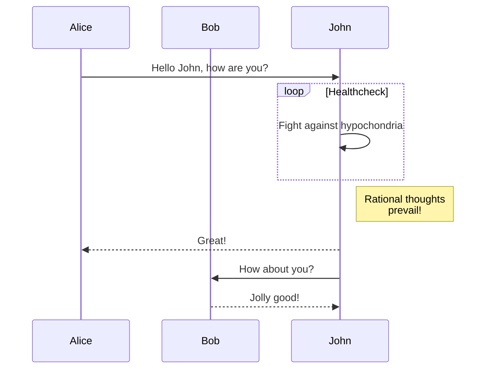

```plantuml
!theme lightgray
package "OpenSees Model" #DDDDDD {
abstract class Element [[./element/Element]]
class Domain [[./Domain]]

Domain o- Element 
Domain o- Node 
Domain o- SP_Constraint 
Domain o- MP_Constraint 
Domain o- LoadPattern
}
```

These are the classes that are used to describe the finite element model
and to store the results of an analysis on this model. The classes
provide include `Domain`, `Element`, `Node`, `Load`, `Constraint` and their
subclasses. Typically, a Domain object is used as a container object to
store and provide access to the `Node`, `Element`, `Load` and `Constraint`
objects created by the `ModelBuilder` object.


- [Component   ](component/DomainComponent)
- [Constraint  ](Constraints)
- [Domain      ](Domain)
- [Load        ](Load)
- [loadBalancer](loadBalancer)
- [Node        ](Node)
- [Partitioner ](Partitioner)
- [Pattern     ](Pattern)


