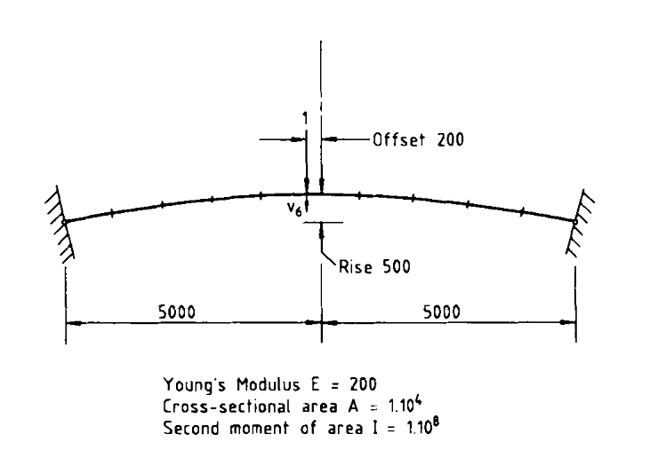

The files for this example are:
- [`arch.py`](./arch.py) - This file contains the function `arch_model` which is used construct the model
- [`IncrementalAnalysis.ipynb`](IncrementalAnalysis.ipynb) - This is the current Jupyter notebook file



{}
