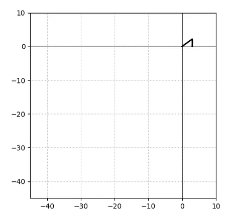

This example is adapted from the OpenSees documentation for the ASDConcrete material.
The analysis is implemented in the Python scripts:

- [`ASDConcrete3D_Ex_CyclicUniaxialCompression.py`](ASDConcrete3D_Ex_CyclicUniaxialCompression.py)
- [`ASDConcrete3D_Ex_Surface.py`](ASDConcrete3D_Ex_Surface.py)
- [`ASDConcrete3D_MakeLaws.py`](ASDConcrete3D_MakeLaws.py)

