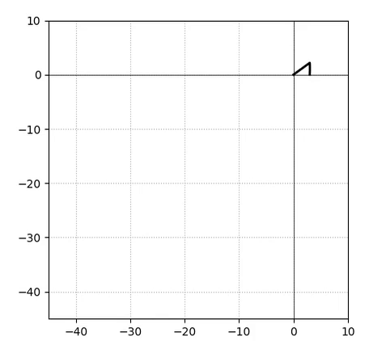

This example is adapted from the OpenSees documentation for the ASDConcrete material.

## Damage Surface

<figure style="text-align: center;">

<figcaption>Damage surface in plane stress.</figcaption>
</figure>

## Uniaxial Envelopes

This test simulates cyclic uniaxial compression of a concrete specimen modeled with
the `ASDConcrete3D` material in plane stress. 
The stress-strain behavior is captured and visualized during the analysis, verifying the regularization and nonlinear evolution
of the constitutive law.

## Model

We begin by defining helper functions to build the stress-strain curves in tension and compression, and to compute an automatic reference length for fracture energy scaling.


{}
```python
def _get_lch_ref(E, ft, Gt, fc, ec, Gc):
    et_el = ft / E
    Gt_min = ft * et_el / 2.0
    hmin_t = Gt / Gt_min / 100.0

    ec1 = fc / E
    ec_pl = (ec - ec1) * 0.4 + ec1
    Gc_min = fc * (ec - ec_pl) / 2.0
    hmin_c = Gc / Gc_min / 100.0

    return min(hmin_t, hmin_c)
```
{}


The tensile and compressive stress-strain curves are assembled with hardening and softening behavior:


{}
```python
def make(E, ft, fc, ec, Gt, Gc):
    lch_ref = _get_lch_ref(E, ft, Gt, fc, ec, Gc)
    Te, Ts, Td = _make_tension(E, ft, Gt / lch_ref)
    Ce, Cs, Cd = _make_compression(E, fc, ec, Gc / lch_ref)
    return (Te, Ts, Td, Ce, Cs, Cd, lch_ref)
```
{}


We now define a single triangle in plane stress, assign the `ASDConcrete3D` material,
and impose strain cycles in compression:


{}
```python
import xara
def main():

    ops = xara.Model('basic', ndm=2, ndf=2)

    E = 30000.0
    v = 0.2
    fc = 30.0
    ft = fc / 10.0
    ec = 2.0 * fc / E
    Gt = 0.073 * fc**0.18
    Gc = 2.0 * Gt * (fc / ft)**2

    Te, Ts, Td, Ce, Cs, Cd, lch_ref = make(E, ft, fc, ec, Gt, Gc)

    ops.nDMaterial("ASDConcrete3D", 1, E, v,
        "-Te", *Te, "-Ts", *Ts, "-Td", *Td,
        "-Ce", *Ce, "-Cs", *Cs, "-Cd", *Cd,
        "-autoRegularization", lch_ref)

    ops.nDMaterial("PlaneStress", 2, 1)

    lch = 250.0
    ops.node(1, 0, 0)
    ops.node(2, lch, 0)
    ops.node(3, 0, lch)
    ops.element("tri31", 1, 1, 2, 3, 1.0, "PlaneStress", 2)

    ops.fix(1, 1, 1)
    ops.fix(2, 0, 1)
    ops.fix(3, 1, 0)
```
{}


The cyclic compression is applied as a series of incremental displacement-controlled steps. Each loop adds a new point to the stress-strain diagram:


{}
```python
    emax = 0.01
    cycles = np.linspace(0.0, emax, 10)

    SX, SY = [0.0], [0.0]
    PX, PY = [0.0], [0.0]

    plt.ion()
    fig, ax = plt.subplots()
    ax.set(xlim=[-emax * 1.1, emax * 0.1], ylim=[-fc * 1.2, fc * 0.1])
    ax.set_title("Cyclic uniaxial compression")
    ax.set_xlabel("\u03B5\u2081\u2081")
    ax.set_ylabel("\u03C3\u2081\u2081")
    ax.grid(linestyle=':')
    the_line, = ax.plot(SX, SY, '-k', linewidth=2.0)
    the_tip, = ax.plot(PX, PY, 'or', markersize=8)

    ops.constraints('Transformation')
    ops.numberer('Plain')
    ops.system('FullGeneral')
    ops.test('NormDispIncr', 1.0e-8, 10, 0)
    ops.algorithm('Newton')
```
{}


In each cycle, the current plastic strain is detected and the displacement increment is applied accordingly:


{}
```python
    for icycle in range(1, len(cycles)):
        ep = -ops.nodeDisp(2)[0] / lch
        current_strain = cycles[icycle]

        ops.pattern("Plain", 1, 1)
        ops.sp(2, 1, -current_strain * lch)

        time_start = ep / current_strain
        ops.setTime(time_start)
        num_incr = max(1, int((current_strain - ep) / emax * 100.0))
        time_incr = (1.0 - time_start) / num_incr

        ops.integrator("LoadControl", time_incr)
        ops.analysis("Static")

        for _ in range(num_incr):
            if ops.analyze(1) != 0:
                break
            strain = ops.eleResponse(1, "material", 1, "strain")
            stress = ops.eleResponse(1, "material", 1, "stress")
            SX.append(strain[0])
            SY.append(stress[0])
            the_line.set_xdata(SX)
            the_line.set_ydata(SY)
            the_tip.set_xdata([SX[-1]])
            the_tip.set_ydata([SY[-1]])
            fig.canvas.draw()
            fig.canvas.flush_events()
```
{}


After each cycle, the load is removed to visualize the unloading path:


{}
```python
        ops.remove("pattern", 1)
        ops.setTime(0.0)
        ops.integrator("LoadControl", 1.0)
        ops.analysis("Static")
        ops.analyze(1)

        strain = ops.eleResponse(1, "material", 1, "strain")
        stress = ops.eleResponse(1, "material", 1, "stress")
        SX.append(strain[0])
        SY.append(stress[0])
        the_line.set_xdata(SX)
        the_line.set_ydata(SY)
        the_tip.set_xdata([SX[-1]])
        the_tip.set_ydata([SY[-1]])
        fig.canvas.draw()
        fig.canvas.flush_events()

    plt.ioff()
    plt.show()
```
{}



