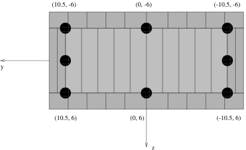
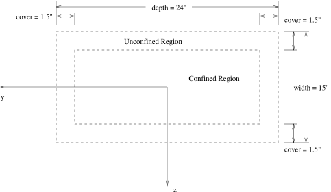
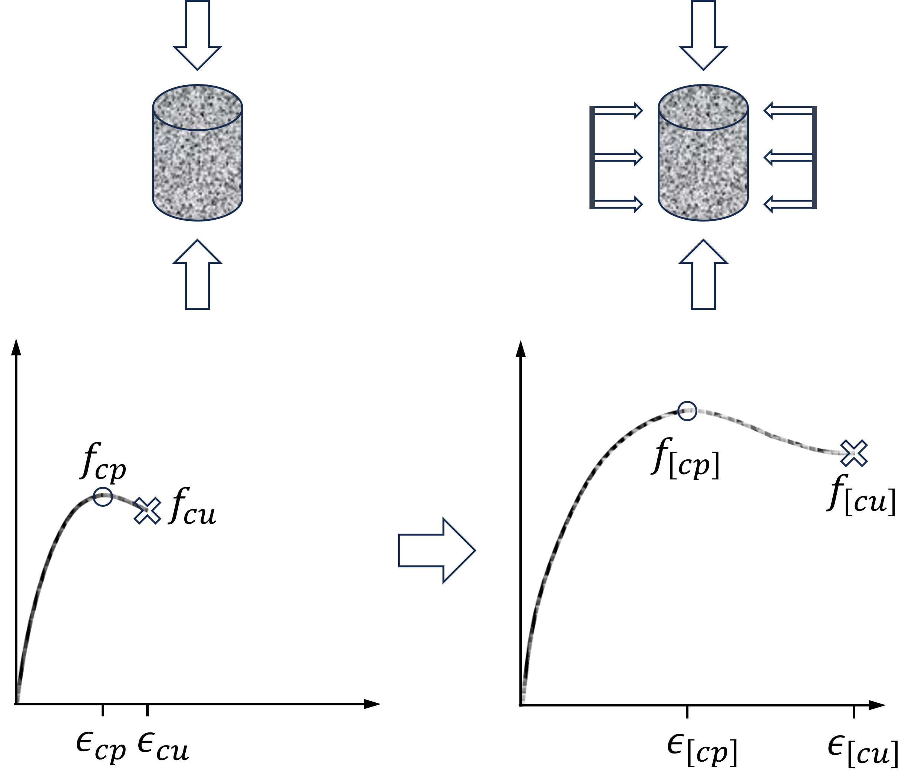
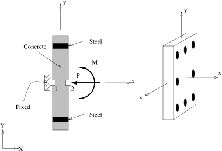
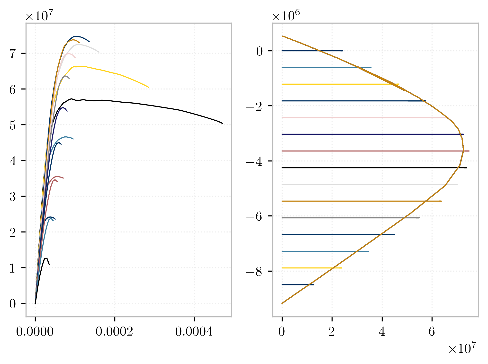

This example performs a moment-curvature analysis of a reinforced
concrete section which is represented by a fiber discretization. 
Because we are only interested in the response quantities of the
cross section, a zero-length element is used to wrap the cross
section. 

## Modeling

The figure below shows the fiber discretization for the section.



The dimensions of the fiber section are shown below. 
The section depth is 24 inches, the width is 15
inches, and there are 1.5 inches of cover around the entire section.

Strong axis bending is about the section $z$-axis. 
The section is separated into confined and unconfined concrete
regions, for which separate fiber discretizations will be generated.
Reinforcing steel bars will be placed around the boundary of the
confined and unconfined regions. 
The fiber discretization for the
section is shown below.







A fiber section is created by grouping various *patches* and *layers*:
> **Note** in Python you must pass the section tag when calling `patch` and `layer`


{}
```python
model.section("Fiber", 1)
# Create the concrete core fibers
model.patch("rect", 1, 10, 1, cover-y1, cover-z1, y1-cover, z1-cover, section=1)
# Create the concrete cover fibers (top, bottom, left, right, section=1)
model.patch("rect", 2, 10, 1, -y1, z1-cover, y1, z1, section=1)
model.patch("rect", 2, 10, 1, -y1, -z1, y1, cover-z1, section=1)
model.patch("rect", 2,  2, 1, -y1, cover-z1, cover-y1, z1-cover, section=1)
model.patch("rect", 2,  2, 1,  y1-cover, cover-z1, y1, z1-cover, section=1)
# Create the reinforcing fibers (left, middle, right, section=1)
model.layer("straight", 3, 3, As, y1-cover, z1-cover, y1-cover, cover-z1, section=1)
model.layer("straight", 3, 2, As, 0.0, z1-cover, 0.0, cover-z1, section=1)
model.layer("straight", 3, 3, As, cover-y1, z1-cover, cover-y1, cover-z1, section=1)
```
{}
{}
```Tcl
section Fiber 1 {

    # Create the concrete core fibers
    patch rect 1 10 1 [expr $cover-$y1] [expr $cover-$z1] [expr $y1-$cover] [expr $z1-$cover]

    # Create the concrete cover fibers (top, bottom, left, right)
    patch rect 2 10 1  [expr -$y1] [expr $z1-$cover] $y1 $z1
    patch rect 2 10 1  [expr -$y1] [expr -$z1] $y1 [expr $cover-$z1]
    patch rect 2  2 1  [expr -$y1] [expr $cover-$z1] [expr $cover-$y1] [expr $z1-$cover]
    patch rect 2  2 1  [expr $y1-$cover] [expr $cover-$z1] $y1 [expr $z1-$cover]

    # Create the reinforcing fibers (left, middle, right)
    layer straight 3 3 $As [expr $y1-$cover] [expr $z1-$cover] [expr $y1-$cover] [expr $cover-$z1]
    layer straight 3 2 $As 0.0 [expr $z1-$cover] 0.0 [expr $cover-$z1]
    layer straight 3 3 $As [expr $cover-$y1] [expr $z1-$cover] [expr $cover-$y1] [expr $cover-$z1]
}    
```
{}



The model consists of two nodes and a `ZeroLengthSection` element. 
A depiction of the element geometry is shown in
figure [zerolength](#zerolength). 
The drawing on the left of
figure [zerolength](#zerolength) shows an edge view of the element where the
local $z$-axis, as seen on the right side of the figure and in
figure [rcsection0](#rcsection0), is coming out of the page. Node 1 is completely
restrained, while the applied loads act on node 2. 
A compressive axial load, $P$, of $180$ kips is applied to the section during the moment-curvature analysis.

 

For the zero length element, a section discretized by concrete and steel
is created to represent the resultant behavior. UniaxialMaterial objects
are created to define the fiber stress-strain relationships: confined
concrete in the column core, unconfined concrete in the column cover,
and reinforcing steel.


## Analysis

The section analysis is performed by the procedure `moment_curvature`
defined in the file `MomentCurvature.tcl` for
Tcl, and `Example2.1.py` for Python. The arguments to the procedure
are the tag `secTag` of the section to be analyzed, 
the axial load `axialLoad` applied to the
section, the maximum curvature `maxK`, and the number `numIncr` of displacement
increments to reach the maximum curvature.

The output for the moment-curvature analysis will be the section forces
and deformations, stored in the file section1.out. In addition, an
estimate of the section yield curvature is printed to the screen.

In the `moment_curvature` procedure, the nodes are defined to be at the same geometric
location and the ZeroLengthSection element is used. 
A single load step
is performed for the axial load, then the integrator is changed to
DisplacementControl to impose nodal displacements, which map directly to
section deformations. 
A reference moment of `1.0` is defined in a `Linear` time series. 
For this reference moment, the [`DisplacementControl`](https://opensees.stairlab.io/user/manual/analysis/integrator/DisplacementControl.html)
integrator will determine the load factor needed to apply the imposed
displacement.

The load factor is the moment, and the nodal rotation is the curvature of the element with zero thickness.

The expected output is:

    Estimated yield curvature: 0.000126984126984


The file `section1.out` contains for each committed state a line with the
load factor and the rotation at node `3`. 
This can be used to plot the moment-curvature relationships shown below.

 
