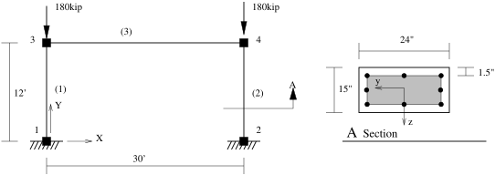
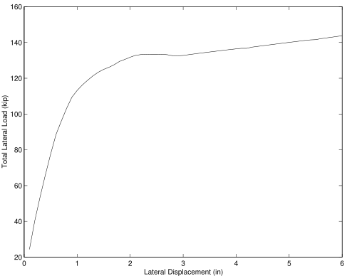
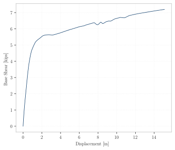
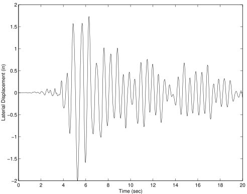
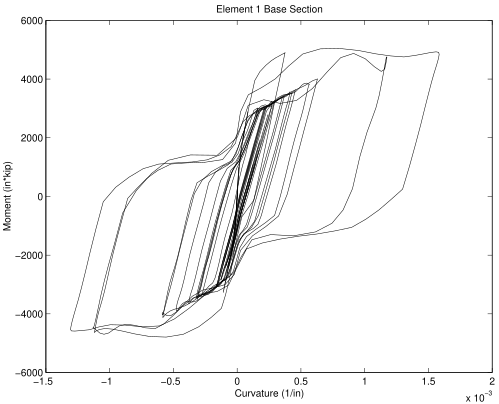

This set of examples investigates the nonlinear analysis of a reinforced
concrete frame. The nonlinear beam column element with a fiber
discretization of the cross section is used in the model.

## Model Building

The function `create_portal` creates a model representing the portal
frame in the figure above.
The model consists of four nodes, two
nonlinear beam-column elements modeling the columns and an
elastic beam element to model the girder. 
For the column elements a section, identical to the section used in Example 2, 
is created using steel and concrete fibers.

1. Begin with nodes and boundary conditions
   
   {}
   ```python
   # create ModelBuilder (with two-dimensions and 3 DOF/node)
   model = ops.Model(ndm=2, ndf=3)
   
   # Create nodes
   # ------------
   model.node(1, (0.0,      0.0))
   model.node(2, (width,    0.0))
   model.node(3, (0.0,   height))
   model.node(4, (width, height))
   
   # set the boundary conditions - command: fix nodeID uxRestrnt? uyRestrnt? rzRestrnt?
   model.fix(1, (1, 1, 1))
   model.fix(2, (1, 1, 1))
   ```
   {}
   {}
   ```tcl
   set width    360
   set height   144
   
   model basic -ndm 2 -ndf 3
   # Create nodes
   #    tag        X       Y 
   node  1       0.0     0.0 
   node  2    $width     0.0 
   node  3       0.0 $height
   node  4    $width $height
   
   
   # Fix supports at base of columns
   #    tag   DX   DY   RZ
   fix   1     1    1    1
   fix   2     1    1    1
   ```
   {}
   

2. Next define the materials   
   
   {}
   ```python
   # Define materials for nonlinear columns
   # ------------------------------------------
   # CONCRETE                          tag  f'c    ec0    f'cu   ecu
   # Core concrete (confined)
   model.uniaxialMaterial("Concrete01", 1, -6.0, -0.004, -5.0, -0.014)
   # Cover concrete (unconfined)
   model.uniaxialMaterial("Concrete01", 2, -5.0, -0.002, -0.0, -0.006)
   
   # STEEL
   # Reinforcing steel 
   fy =    60.0;      # Yield stress
   E  = 30000.0;      # Young's modulus
   #                                tag fy  E   b
   model.uniaxialMaterial("Steel01", 3, fy, E, 0.01)
   ```
   {}
   {}
   ```tcl
   # Core concrete (confined)
   #                           tag  f'c     ec0  f'cu        ecu
   uniaxialMaterial Concrete01  1  -6.0  -0.004  -5.0     -0.014

   # Cover concrete (unconfined)
   uniaxialMaterial Concrete01  2  -5.0  -0.002   0.0     -0.006

   # Reinforcing steel 
   set fy 60.0;      # Yield stress
   set E 30000.0;    # Young's modulus
   #                        tag  fy E0    b
   uniaxialMaterial Steel01  3  $fy $E 0.01
   ```
   {}
   

3. Define a cross section for the columns, following the procedure from the [moment-curvature example](../example2/)
   
   {}
   ```python
    # Define cross-section for nonlinear columns
    # ------------------------------------------
    # set some parameters
    colWidth = 15.0
    colDepth = 24.0
    cover    =  1.5
    As       =  0.6      # area of no. 7 bars

    # some variables derived from the parameters
    y1 = colDepth/2.0
    z1 = colWidth/2.0

    model.section("Fiber", 1)
    # Add the concrete core fibers
    model.patch("rect", 1, 10, 1, cover-y1, cover-z1, y1-cover, z1-cover, section=1)
    # Add the concrete cover fibers (top, bottom, left, right)
    model.patch("rect", 2, 10, 1, -y1, z1-cover, y1, z1, section=1)
    model.patch("rect", 2, 10, 1, -y1, -z1, y1, cover-z1, section=1)
    model.patch("rect", 2,  2, 1, -y1, cover-z1, cover-y1, z1-cover, section=1)
    model.patch("rect", 2,  2, 1,  y1-cover, cover-z1, y1, z1-cover, section=1)
    # Add the reinforcing fibers (left, middle, right, section=1)
    model.layer("straight", 3, 3, As, y1-cover, z1-cover, y1-cover, cover-z1, section=1)
    model.layer("straight", 3, 2, As,      0.0, z1-cover,      0.0, cover-z1, section=1)
    model.layer("straight", 3, 3, As, cover-y1, z1-cover, cover-y1, cover-z1, section=1)
   ```
   {}
   {}
   ```tcl
   # Define cross-section for nonlinear columns
   # ------------------------------------------

   # set some parameters
   set colWidth 15
   set colDepth 24 

   set cover  1.5
   set As    0.60;     # area of no. 7 bars

   # some variables derived from the parameters
   set y1 [expr $colDepth/2.0]
   set z1 [expr $colWidth/2.0]

   section Fiber 1 {
       # Add the concrete core fibers
       patch rect 1 10 1 [expr $cover-$y1] [expr $cover-$z1] [expr $y1-$cover] [expr $z1-$cover]

       # Add the concrete cover fibers (top, bottom, left, right)
       patch rect 2 10 1  [expr -$y1] [expr $z1-$cover] $y1 $z1
       patch rect 2 10 1  [expr -$y1] [expr -$z1] $y1 [expr $cover-$z1]
       patch rect 2  2 1  [expr -$y1] [expr $cover-$z1] [expr $cover-$y1] [expr $z1-$cover]
       patch rect 2  2 1  [expr $y1-$cover] [expr $cover-$z1] $y1 [expr $z1-$cover]

       # Add the reinforcing fibers (left, middle, right)
       layer straight 3 3 $As [expr $y1-$cover] [expr $z1-$cover] [expr $y1-$cover] [expr $cover-$z1]
       layer straight 3 2 $As 0.0 [expr $z1-$cover] 0.0 [expr $cover-$z1]
       layer straight 3 3 $As [expr $cover-$y1] [expr $z1-$cover] [expr $cover-$y1] [expr $cover-$z1]
   }
   ```
   {}
   

## Gravity Analysis

We now implement a function called `gravity_analysis`
which takes the instance of `Model` returned by `create_portal`,
and proceeds to impose gravity loads and perform a static analysis.
Its use will look like:


{}
```python
# Create the model
model = create_portal()

# perform analysis under gravity loads
status = gravity_analysis(model)
```
{}
{}
```tcl
create_portal;
gravity_analysis;
```
{}


Inside the function, a single load pattern with a `Linear` time series is created and two vertical nodal loads  are added acting at nodes `3` and `4`:


{}
```python
...
model.pattern("Plain", 1, "Linear", load={
# nodeID  xForce yForce zMoment
     3:   [ 0.0,   -P,   0.0],
     4:   [ 0.0,   -P,   0.0]
})
```
{}
{}
```tcl
# Create a Plain load pattern with a Linear TimeSeries
pattern Plain 1 "Linear" {
      # Create nodal loads at nodes 3 & 4
      #    nd    FX          FY  MZ 
      load  3   0.0  [expr -$P] 0.0
      load  4   0.0  [expr -$P] 0.0
}
```
{}



The model contains material non-linearities, so a solution algorithm of type `Newton` is used. 

{}
```python
model.algorithm("Newton")
```
{}
{}
```tcl
algorithm Newton;
```
{}


<!--
The solution algorithm uses a `ConvergenceTest` which
tests convergence of the equilibrium solution with the norm of the
displacement increment vector. 
-->

For this nonlinear problem, the gravity loads are applied incrementally until the full load is applied. 
To achieve this, a `LoadControl` integrator is used which advances the solution with
an increment of `0.1` at each load step. 

{}
```python
model.integrator("LoadControl", 0.1)
```
{}
{}
```tcl
integrator LoadControl 0.1;
```
{}


<!--
Once all the components of an analysis are defined, the Analysis object
itself is created. For this problem a Static analysis is defined. 

{}
```tcl
analysis Static
```
{}
{}
```python
model.analysis("Static")
```
{}

-->

To achieve the full gravity load, 10 load steps are performed.

{}
```python
model.analyze(10)
```
{}
{}
```tcl
analyze 10
```
{}


At end of analysis, the state at nodes 3 and 4 is printed. The state of
element 1 is also reported.

<!--
For the two nodes, displacements and loads are given. For the
beam-column elements, the element end forces in the local system are
provided.

The `nodeGravity.out` file contains ten lines, each line containing 7
entries. The first entry is time in the domain at end of the load step.
The next 3 entries are the displacements at node 3, and the final 3
entries the displacements at node 4.
-->

## Pushover analysis

After performing the gravity load analysis on the model, the time in the
domain is reset to `0.0` and the current value of all loads acting are
held constant. 
A new load pattern with a linear time series and horizontal loads acting at nodes `3` and `4` is then added to the model.

The static analysis used to perform the gravity load analysis is 
modified to use the [`DisplacementControl`](https://opensees.stairlab.io/user/manual/analysis/integrator/DisplacementControl.html) integrator. 
At each new step
in the analysis the integrator will determine the load increment necessary to increment the horizontal displacement at node `3` by `0.1` inches. 
`60` analysis steps are performed in this new analysis.

For this analysis the nodal displacements at node `3` will be
stored in the variable `u` for post-processing. 
<!--
In addition,
the end forces in the local coordinate system for elements 1 and 2 will
be stored in the file `elePushover.out`. 
-->

At the end of the analysis, the
state of node 3 is printed to the screen.

<!--
In addition to what is displayed on the screen, the file `node32.out` and
`ele32.out` have been created by the script. Each line of `node32.out`
contains the time, DX, DY and RZ for node 3 and DX, DY and RZ for node 4
at the end of an iteration. Each line of `eleForce.out` contains the time,
and the element end forces in the local coordinate system. 
-->

A plot of the load-displacement relationship at node 3 is shown in
the figure below.

<!-- 
 
-->




## `transient_analysis`

<!-- 3.3 -->

The concrete frame which has undergone
the gravity load analysis of Example 3.1 is now subjected to a uniform
earthquake excitation.

After performing the gravity load analysis, the time in the domain is
reset to 0.0 and the time series for all active loads is set to
constant. This prevents the gravity load from being scaled with each
step of the dynamic analysis.


{}
```python
model.loadConst(time=0.0)
```
{}
{}
```tcl
loadConst -time 0.0
```
{}


Mass terms are added to nodes 3 and 4. A new uniform
excitation load pattern is created. The excitation acts in the
horizontal direction and reads the acceleration record and time interval
from the file `ARL360.g3`. The file `ARL360.g3` is created from the PEER
Strong Motion Database (http://peer.berkeley.edu/smcat/) record
`ARL360.at2` using the Tcl procedure `ReadSMDFile` contained in the file
`ReadSMDFile.tcl`.

The static analysis object and its components are first deleted so that
a new transient analysis object can be created.

A new solution Algorithm of type `Newton` is then created. The solution
algorithm uses a `ConvergenceTest` which tests convergence on the norm of
the displacement increment vector. The integrator for this analysis will
be of type Newmark with a \(\gamma = 0.25\) and \(\beta = 0.5\). 

The
integrator will add some stiffness proportional damping to the system,
the damping term will be based on the last committed stifness of the
elements, i.e. \(C = a_c K_{\text{commit}}\) with \(a_c = 0.000625\). 

The equations are formed using a banded storage scheme, so the System is
BandGeneral. The equations are numbered using an RCM (reverse Cuthill-McKee)
numberer. The constraints are enforced with a Plain constraint handler.

Once all the components of an analysis are defined, the Analysis object
itself is created. For this problem a Transient Analysis object is used.
`2000` time steps are performed with a time step of `0.01`.

In addition to the transient analysis, two eigenvalue analysis are
performed on the model. The first is performed after the gravity
analysis and the second after the transient analysis.

For this analysis the nodal displacenments at Nodes 3 and 4 will be
stored in the file `nodeTransient.out` for post-processing. In addition
the section forces and deformations for the section at the base of
column 1 will also be stored in two seperate files. The results of the
eigenvalue analysis will be displayed on the screen.


```
Gravity load analysis completed
eigen values at start of transient: 2.695422e+02  1.750711e+04  
Transient analysis completed SUCCESSFULLY
eigen values at start of transient: 1.578616e+02  1.658481e+04  


 Node: 3
     Coordinates  : 0 144 
     commitDisps: -0.0464287 -0.0246641 0.000196066 
     Velocities   : -0.733071 1.86329e-05 0.00467983 
     commitAccels: -9.13525 0.277302 38.2972 
     unbalanced Load: -3.9475 -180 0 
     Mass : 
       0.465839 0 0 
       0 0.465839 0 
       0 0 0 

     Eigenvectors: 
       -1.03587 -0.0482103 
       -0.00179081 0.00612275 
       0.00663473 3.21404e-05 
```

The two eigenvalues for the eigenvalue analysis are printed to the
screen. The state of node 3 at the end of the analysis is also printed.
The information contains the last committed displacements, velocities
and accelerations at the node, the unbalanced nodal forces and the nodal
masses. In addition, the eigenvector components of the eigenvector
pertaining to the node 3 is also displayed.

In addition to the contents displayed on the screen, three files have
been created. 
Each line of `nodeTransient.out` contains the domain time,
and DX, DY and RZ for node 3. Plotting the first and second columns of
this file the lateral displacement versus time for node 3 can be
obtained as shown in the figure below. Each line of the files `ele1secForce.out` 
and `ele1secDef.out` contain the domain time and the forces and deformations
for section 1 (the base section) of element 1. These can be used to
generate the moment-curvature time history of the base section of column
1 as shown below.







## Complete Analysis

Summarizing, we now have the following functions:

| Function             | Description         |
|----------------------|---------------------|
| `create_portal`      | Creates a model of a portal frame
| `gravity_analysis`   | Performs a gravity analysis on a model
| `pushover_analysis`  | Performs a pushover analysis on a model
| `transient_analysis` | Performs a transient analysis on a model


A complete analysis may look as follows:
```python
def main():
    # Create the model
    model = create_portal()

    # perform analysis under gravity loads
    status = gravity_analysis(model)

    if status == ops.successful:
        print("Gravity analysis completed SUCCESSFULLY\n")
    else:
        print(f"Gravity analysis FAILED ({status = })\n")

    status = pushover_analysis(model)
    # Print a message to indicate if analysis successful or not
    if status == ops.successful:
        print(f"\nPushover analysis completed SUCCESSFULLY\n")
    else:
        print(f"Pushover analysis FAILED ({status = })\n")

    # Print the state at node 3
    model.print("node", 3)

if __name__ == "__main__":
    main()
```

