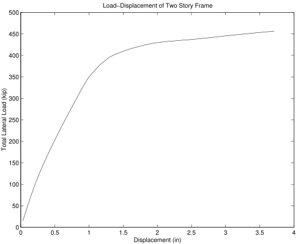

## Example 4.1

This example is of a reinforced concrete multibay two story frame, as shown in Figure 1, subject to gravity loads.

A model of the frame shown in Figure 1 is created. 
The number of objects in the model is dependent on the parameter `numBay`. 
The `(numBay + 1)*3` nodes are created, one column line at a time, with the node at the base of the
columns fixed in all directions. 
As always, our first step is to create an instance of the `Model` Class:


{}
```python
import opensees.openseespy as ops

model = ops.Model(ndm=3, ndf=6)
```
{}
{}
```tcl
model -ndm 3 -ndf 6
```
{}



Three materials are constructed, one
for the concrete core, one for the concrete cover and one for the
reinforcement steel. Three fiber discretized sections are then built,
one for the exterior columns, one for the interior columns and one for the girders. 

Each of the members in the frame is modeled using
inelastic beam-column elements with `nip = 4` integration points and a
`Linear` geometric transformation.


For gravity loads, a single load pattern with a linear time series and
two vertical nodal loads acting at the first and second floor nodes of
each column line is used. The load at the lower level is twice that of
the upper level and the load on the interior columns is twice that of
the exterior columns.

For the lateral load analysis, a second load pattern with a linear time
series is introduced after the gravity load analysis. Associated with
this load pattern are two nodal loads acting on nodes 2 and 3, with the
load level at node 3 twice that acting at node 2.

As in the [linear truss](../example1/) example, the integrator for the analysis will be `LoadControl`.
However, in order to handle the inelastic response, a load
step increment of `0.1` is used and the analysis will be performed with `10` steps. 

{}
```python
model.integrator("LoadControl", 0.1)
```
{}
{}
```tcl
integrator LoadControl 0.1;
```
{}



Once the components of the analysis have been defined, the analysis object is created. 
For this problem a `Static` analysis is used and `10` steps are performed to load the model
with the desired gravity load.

{}
```python
model.analyze(10)
```
{}
{}
```tcl
analyze 10
```
{}



After the gravity load analysis has been performed, the gravity loads
are set to constant and the time in the domain is reset to 0.0. A new
`LoadControl` integrator is now added. 
The new integrator has an initial load step of `1.0`, and is allowed to vary between `0.02` and `2.0`
depending on the number of iterations required to achieve convergence at
each load step. `100` steps are then performed.


The output consists of the file `Node41.out` containing a line for each
step of the lateral load analysis. Each line contains the load factor,
the lateral displacements at nodes 2 and 3. A plot of the
load-displacement curve for the frame is given in Figure 2.




