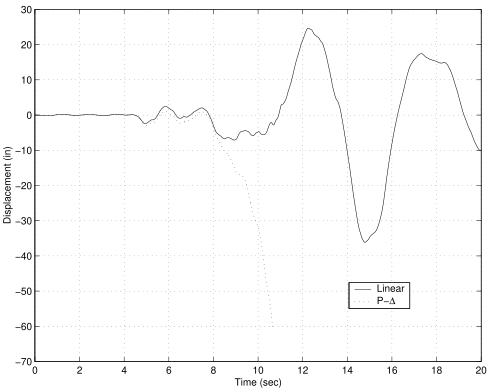

A three-dimensional reinforced concrete rigid frame,
is subjected to bi-directional earthquake ground motion.

1.  [`Example5.tcl`](Example5.tcl)
2.  [`RCsection.tcl`](RCsection.tcl)

Or for Python:
1.  [`Example5.py`](Example5.py)
2.  [`render.py`](render.py)

In both cases, the following ground motion records are required:

3.  [`tabasFN.txt`](tabasFN.txt)
4.  [`tabasFP.txt`](tabasFP.txt)

## Modeling

A model of the rigid frame shown in the
figure below is created. The model consists of three stories
and one bay in each direction. Rigid diaphragm multi-point constraints
are used to enforce the rigid in-plane stiffness assumption for the
floors. Gravity loads are applied to the structure and the 1978 Tabas
acceleration records are the uniform earthquake excitations.

Nonlinear beam column elements are used for all members in the
structure. The beam sections are elastic while the column sections are
discretized by fibers of concrete and steel. Elastic beam column
elements may have been used for the beam members; but, it is useful to
see that section models other than fiber sections may be used in the
nonlinear beam column element.

## Analysis

A solution Algorithm of type Newton is used for the nonlinear problem.
The solution algorithm uses a ConvergenceTest which tests convergence on
the norm of the energy increment vector. The integrator for this
analysis will be of type `Newmark` with a $\gamma$ of `0.25` and a $\beta$
of `0.5`. 
Due to the presence of the multi-point constraints, a
`Transformation` constraint handler is used. 

<!--
The equations are formed
using a sparse storage scheme which will perform pivoting during the
equation solving, so the System is SparseGeneral. As SparseGeneral will
perform it's own internal numbering of the equations, a Plain numberer
is used which simply assigns equation numbers to the degrees-of-freedom.
-->

Once all the components of an analysis are defined, the Analysis 
itself is defined. For this problem a `Transient` analysis is used.
`2000` steps are performed with a time step of `0.01`.

## Post-Processing

The nodal displacements at nodes `9`, `14`, and `19` (the retained nodes for
the rigid diaphragms) will be stored in the file `node51.out` for
post-processing.

The results consist of the file `node.out`, which contains a line for
every time step. Each line contains the time and the horizontal and
vertical displacements at the diaphragm retained nodes (`9`, `14` and `19`)
i.e. time Dx9 Dy9 Dx14 Dy14 Dx19 Dy19. The horizontal displacement time
history of the first floor diaphragm node 9 is shown in the
figure below. Notice the increase in period after about 10
seconds of earthquake excitation, when the large pulse in the ground
motion propogates through the structure. The displacement profile over
the three stories shows a soft-story mechanism has formed in the first
floor columns. The numerical solution converges even though the drift is
$\approx 20 \%$. The inclusion of $P-\Delta$ effects shows structural
collapse under such large drifts.

{}

