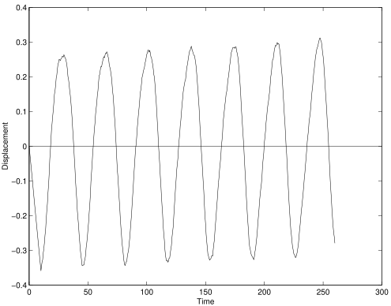

In this example a simply supported beam is modelled with two dimensional solid
elements.
The example is implemented in both Tcl and Python:

1.  [`Example6.tcl`](Example6.tcl)
2.  [`Example6.py`](Example6.py)

Each node of the analysis has two displacement degrees of freedom. Thus the model is defined with
`ndm = 2` and `ndf = 2`. 

A mesh is generated using
the `block2D` command. The number of nodes in the local \(x\)-direction of
the block is $nx$ and the number of nodes in the local \(y\)-direction of
the block is $ny$. The `block2D` generation nodes `{1,2,3,4}` are prescribed
to define the two dimensional domain of the beam, which is of size
\(40\times10\).

Three different quadrilateral elements can be used for the analysis.
These may be created using the names `"BbarQuad"`, `"EnhancedQuad"` or
`"Quad"`. 
This is a plane strain problem. An elastic isotropic material is used.

For initial gravity load analysis, a single load pattern with a linear
time series and two vertical nodal loads are used.

A solution algorithm of type `Newton` is used for the problem. The
solution algorithm uses a `ConvergenceTest` which tests convergence on the
norm of the energy increment vector. Ten static load steps are performed.

Following the static analysis, the `wipeAnalysis` and `remove loadPatern` 
commands are used to remove the nodal loads and create a new
analysis. The nodal displacements have not changed. However, with the
external loads removed the structure is no longer in static equilibrium.

The integrator for the dynamic analysis if of type `GeneralizedMidpoint`
with \(\alpha = 0.5\). This choice is uconditionally stable and energy
conserving for linear problems. Additionally, this integrator conserves
linear and angular momentum for both linear and non-linear problems. The
dynamic analysis is performed using \(100\) time increments with a time
step \(\Delta t = 0.50\).

The results consist of the file `Node.out`, which contains a line for
every time step. Each line contains the time and the vertical
displacement at the bottom center of the beam. The time history is shown
in Figure 1.

{}

