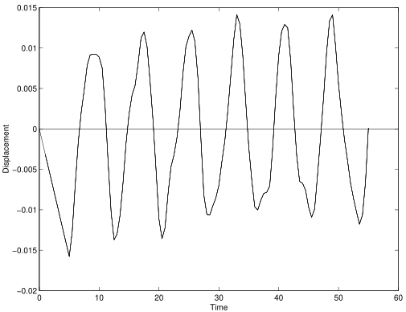

In this example a simple problem in shell dynamics is considered. The
structure is a curved hoop shell structure that looks like the roof of a
Safeway.

1.  [`Example7.tcl`](Example7.tcl)
2.  [`Example7.py`](Example7.py)

Renderings are created from the script [`render.py`](./render.py), which
uses the [`sees`](https://pypi.org/project/sees) Python package.

## Modeling

For shell analysis, a typical shell element is defined as a surface in
three dimensional space. Each node of a shell analysis has six degrees
of freedom, three displacements and three rotations. Thus the model is
defined with $ndm = 3$ and $ndf = 6$.

For this model, a mesh is generated using the `block2D` command. The
number of nodes in the local x-direction of the block is `nx` and the
number of nodes in the local y-direction of the block is `ny`. The
block2D generates nodes with tags `{1,2,3,4, 5,7,9}` such that the
structure is curved in space.


{}
```tcl
# generate the nodes and elements
block2D $nx $ny 1 1 $element $eleArgs {
    1   -20    0     0
    2   -20    0    40
    3    20    0    40
    4    20    0     0
    5   -10   10    20 
    7    10   10    20   
    9     0   10    20 
} 
```
{}
{}
```python
# generate the surface nodes and elements
surface = model.surface((nx, ny),
              element="ShellMITC4", args=(1,),
              points={
                  1: [-20.0,  0.0,  0.0],
                  2: [-20.0,  0.0, 40.0],
                  3: [ 20.0,  0.0, 40.0],
                  4: [ 20.0,  0.0,  0.0],
                  5: [-10.0, 10.0, 20.0],
                  7: [ 10.0, 10.0, 20.0],
                  9: [  0.0, 10.0, 20.0]
              })
```
{}



The shell element is constructed using the `ShellMITC4` formulation. 
An elastic membrane-plate material section model,
appropriate for shell analysis, is constructed using the `section`
command and the
`"ElasticMembranePlateSection"` formulation. In this case, the elastic modulus
$E = 3.0e3$, Poisson's ratio $\nu =  0.25$, the thickness $h = 1.175$
and the mass density per unit volume $\rho = 1.27$


Boundary conditions are applied using the `fixZ` command. In this case,
all the nodes whose $z$-coordiate is $0.0$ have the boundary condition
`{1,1,1, 0,1,1}`: all degrees-of-freedom are fixed except rotation about
the x-axis, which is free. The same boundary conditions are applied
where the $z$-coordinate is $40.0$.

A solution algorithm of type `Newton` is used for the problem. 
The solution algorithm uses a ConvergenceTest which tests convergence on the
norm of the energy increment vector. 
Five static load steps are performed.

For initial gravity load analysis, a single load pattern with a linear
time series and three vertical nodal loads are used. A scaled rendering
of the deformed shape under gravity loading is shown below:

{}

## Dynamic Analysis

After the static analysis, the wipeAnalysis and remove
loadPatern commands are used to remove the nodal loads and create a new
analysis. The nodal displacements have not changed. However, with the
external loads removed the structure is no longer in static equilibrium.

The integrator for the dynamic analysis if of type `GeneralizedMidpoint`
with $\alpha = 0.5$. This choice is uconditionally stable and energy
conserving for linear problems. Additionally, this integrator conserves
linear and angular momentum for both linear and non-linear problems. The
dynamic analysis is performed using $250$ time increments with a time
step $\Delta t = 0.50$.


The results consist of the file `Node.out`, which contains a line for
every time step. Each line contains the time and the vertical
displacement at the upper center of the hoop structure. The time history
is shown in the figure below.



