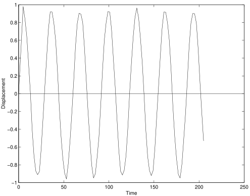

In this example a simple problem in solid dynamics is considered. The
structure is a cantilever beam modelled with three dimensional solid
elements.

1.  [`Example8.tcl`](src/Example8.tcl)
1.  [`Example8.py`](src/Example8.py)

For three dimensional analysis, a typical solid element is defined as a
volume in three dimensional space. Each node of the analysis has three
displacement degrees of freedom. Thus the model is defined with
`ndm = 3` and `ndf = 3`.

For this model, a mesh is generated using the `block3D` command. The
number of nodes in the local $x$-direction of the block is `nx`, the
number of nodes in the local $y$-direction of the block is `ny` and the
number of nodes in the local $z$-direction of the block is `nz`. The
`block3D` generation nodes `{1,2,3,4,5,6,7,8}` are prescribed to define the
three dimensional domain of the beam, which is of size
$2 \times 2 \times 10$.


{}
```tcl
# mesh generation
block3D $nx $ny $nz   1 1  $element  $eleArgs {
    1   -1     -1      0
    2    1     -1      0
    3    1      1      0
    4   -1      1      0 
    5   -1     -1     10
    6    1     -1     10
    7    1      1     10
    8   -1      1     10
}
```
{}
{}
```python
model.block3D(nx, ny, nz, 1, 1, Brick, 1, {
              1: [-1.0, -1.0,  0.0],
              2: [ 1.0, -1.0,  0.0],
              3: [ 1.0,  1.0,  0.0],
              4: [-1.0,  1.0,  0.0],
              5: [-1.0, -1.0, 10.0],
              6: [ 1.0, -1.0, 10.0],
              7: [ 1.0,  1.0, 10.0],
              8: [-1.0,  1.0, 10.0]})
```
{}


Two possible brick elements can be used for the analysis. These may be
created using the terms `StdBrick` or `BbarBrick`. An elastic isotropic
material is used.

For initial gravity load analysis, a single load pattern with a linear
time series and a single nodal loads is used.

Boundary conditions are applied using the `fixZ` command. In this case,
all the nodes whose $z$-coordiate is $0.0$ have the boundary condition
`{1,1,1}`, fully fixed.

A solution algorithm of type Newton is used for the problem. The
solution algorithm uses a ConvergenceTest which tests convergence on the
norm of the energy increment vector. Five static load steps are
performed.

Subsequent to the static analysis, the wipeAnalysis and remove
loadPatern commands are used to remove the nodal loads and create a new
analysis. The nodal displacements have not changed. However, with the
external loads removed the structure is no longer in static equilibrium.

The integrator for the dynamic analysis if of type GeneralizedMidpoint
with \(\alpha = 0.5\). This choice is uconditionally stable and energy
conserving for linear problems. Additionally, this integrator conserves
linear and angular momentum for both linear and non-linear problems. The
dynamic analysis is performed using $100$ time increments with a time
step \(\Delta t = 2.0\).

The deformed shape at the end of the analysis is rendered below:

{}

The results consist of the file `cantilever.out`, which contains a line
for every time step. Each line contains the time and the horizontal
displacement at the upper right corner the beam. 
This is plotted in the figure below:



