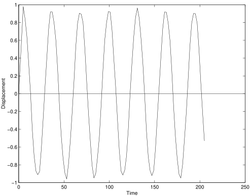

Each node of the analysis has three displacement degrees of freedom. 
Thus the model is defined with `ndm = 3` and `ndf = 3`.


{}
```tcl
model -ndm 3 -ndf 3
```
{}
{}
```python
import xara

model = xara.Model(ndm=3, ndf=3)
```
{}


The finite element mesh is generated using the [`block3D`](https://xara.so/user/manual/meshing/block3D.html) method. 
The first three arguments, `nx`, `ny`, and `nz` specify the number of
nodes to be generated in the $x$, $y$, and $z$ directions.
For this example a mesh of $2 \times 2 \times 10$ elements is produced.
The next two arguments specify from where to begin generating element and node tags.
The sixth argument `element` is a string which selects the type of element to be generated,
and the seventh argument `eleArgs` is a [tuple](https://docs.python.org/3/tutorial/datastructures.html#tuples-and-sequences) 
of arguments to be passed to each element that is created.
The final argument of the `block3D` command is a block specifying the location of up to 8 reference nodes.


{}
```tcl
# mesh generation
block3D $nx $ny $nz   1 1  $element  $args {
    1   -1     -1      0
    2    1     -1      0
    3    1      1      0
    4   -1      1      0 
    5   -1     -1     10
    6    1     -1     10
    7    1      1     10
    8   -1      1     10
}
```
{}
{}
```python
model.block3D((nx, ny, nz), (1, 1), "Brick", 1, {
              1: [-1.0, -1.0,  0.0],
              2: [ 1.0, -1.0,  0.0],
              3: [ 1.0,  1.0,  0.0],
              4: [-1.0,  1.0,  0.0],
              5: [-1.0, -1.0, 10.0],
              6: [ 1.0, -1.0, 10.0],
              7: [ 1.0,  1.0, 10.0],
              8: [-1.0,  1.0, 10.0]})
```
{}


Two possible brick elements can be used for the analysis. These may be
created using either `StdBrick` or `BbarBrick`. 
An elastic isotropic material is used.

For initial gravity load analysis, a single load pattern with a linear
time series and a single nodal loads is used.

Boundary conditions are applied using the `fixZ` command. In this case,
all the nodes whose $z$-coordiate is $0.0$ have the boundary condition
`{1,1,1}`, fully fixed.

A solution algorithm of type Newton is used for the problem. The
solution algorithm uses a ConvergenceTest which tests convergence on the
norm of the energy increment vector. 
Five static load steps are performed.

## Dynamics

Following the static analysis, the `wipeAnalysis` and `remove` commands 
are used to remove the nodal loads and create a new analysis. 
The nodal displacements have not changed. 
However, with the external loads removed the structure is no longer in static equilibrium.

The integrator for the dynamic analysis if of type GeneralizedMidpoint
with \(\alpha = 0.5\). This choice is uconditionally stable and energy
conserving for linear problems. Additionally, this integrator conserves
linear and angular momentum for both linear and non-linear problems. The
dynamic analysis is performed using $100$ time increments with a time
step \(\Delta t = 2.0\).

The deformed shape at the end of the analysis is rendered below:

{}

The results consist of the file `cantilever.out`, which contains a line
for every time step. Each line contains the time and the horizontal
displacement at the upper right corner the beam. 
This is plotted in the figure below:



