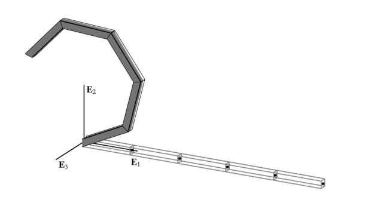
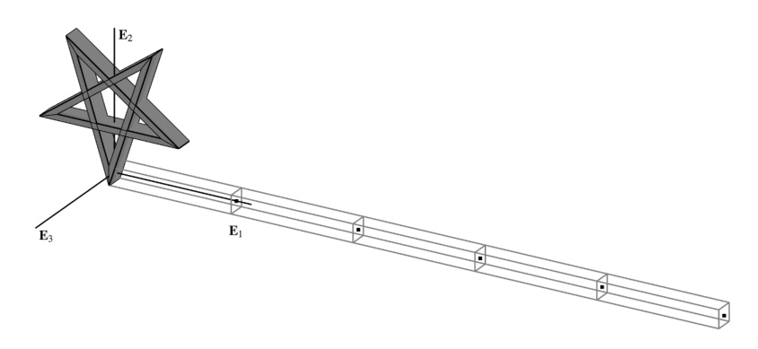

The cantilever beam depicted below is subjected to *either* a point moment
$\boldsymbol{M}$ or a point force $F \, \mathbf{E}_3$ at its free end $\xi=L$. 
The centerline of the reference configuration is given by
$\boldsymbol{x}_0(\xi) = \xi\,\mathbf{E}_1$. 

<figure id="fig:cantilever">
<figure id="fig:helical-a">

<figcaption><em>λ</em> = 0.7</figcaption>
</figure>
<figure id="fig:helical-b">

<figcaption><em>λ</em> = 2</figcaption>
</figure>
<figcaption>Deformed configuration of cantilever beam under two moment magnitudes.</figcaption>
</figure>

### End Moment

When $F = 0$ the configuration is expected to remain in the $\mathbf{E}_1 - \mathbf{E}_2$ plane. 
Consequently, the out-of-plane director $\mathbf{D}_3$ does not change during deformation so that
$\mathbf{d}_3 = \mathbf{D}_3$. 
This simplification has two important consequences:

- There is no distinction between a spatially applied moment
  $\boldsymbol{M} = M \, \mathbf{d}_3$ and a materially applied moment
  $\boldsymbol{M} = M \, \mathbf{D}_3$.

- The rotation $\boldsymbol{\Lambda}$ becomes vectorial, its
  variations $\boldsymbol{u}_{\scriptscriptstyle{\Lambda}}^{(i)}$ at
  different configurations $\chi^{(i)}$ can be added, and the sum of
  these variations over the course of global equilibrium iterations is
  equivalent to the logarithmic rotation increment:
  $$\sum_{i=0}^n \boldsymbol{u}_{\scriptscriptstyle{\Lambda}}^{(i)} \equiv \boldsymbol{\theta} 
       = \operatorname{Log} \left(\boldsymbol{\Lambda}_{(n)}\boldsymbol{\Lambda}_{(0)}^{\mathrm{t}}\right).$$

In this case, the moment loading can be treated identically for all
analyses by simply scaling a constant *reference* force vector for the
node at $\xi=L$: 

$$\mathbf{f}_{M,\text{ref}} = \begin{pmatrix}
     0 & 0 & M
  \end{pmatrix}^{\mathrm{t}}
$$

where the reference magnitude $M = \lambda 2 \pi EI/L$ varies with $\lambda=1/8, \ 1$, and $2$ for
different cases causing the cantilever to loop over itself $\lambda$
times. The following parameters are used: 

$$\begin{array}{lcr}
    L  &=&    10\hphantom{..}    \\ % ,& A  &= 1 \\
    E  &=&    10^4  \\ % ,& I  &= 10^{-2} \\
    G  &=&    10^4  \\ % ,& J  &= 10^{-2} \\
\end{array}
\qquad\qquad
\begin{array}{lcr}
    A  &=& 1\hphantom{..} \\
    I  &=& 10^{-2} \\
    J  &=& 10^{-2} \\
\end{array}
$$

The simulation uses a *single* load step with uniform
meshes of 5 and 10 elements for the 2-node and 3-node variants of all
formulations in
Table [\[tab:variants\]](#tab:variants){reference-type="ref"
reference="tab:variants"}. The solution requires only two iterations for
each formulation matching the ideal performance reported by
[@simo1986threedimensional]. 
The tip displacements for the case $\lambda = 1/8$ are collected in
below along with the analytic solution of the governing boundary value problem is given by: 

$$\left\{
  \begin{aligned}
  \boldsymbol{x}(\xi)&=\frac{EI}{M} \sin \vartheta(\xi) \, \mathbf{E}_1
                      + \frac{EI}{M}\left(\cos \vartheta(\xi)-1\right) \, \mathbf{E}_2 \\
    \vartheta(\xi)   &=  \xi \frac{M}{EI}
  \end{aligned}
  \right.$$ 

where $\vartheta$ parameterizes the rotation
$\boldsymbol{\Lambda}(\xi) = \operatorname{Exp} \vartheta(\xi) \, \mathbf{E}_3$.
This result is derived in
Appendix [\[sec:closed-solution\]](#sec:closed-solution){reference-type="ref"
reference="sec:closed-solution"}. The displacements for $n=2$-node
elements match exactly those reported by
[@ibrahimbegović1995computational] for both the natural `None`, and the
logarithmic `Init`/`Incr` variants. For $n=3$-node elements, the results
match the analytic solution up to the reported precision.

### End Force

In this case the cantilever beam is subjected only to a transverse force
of $\boldsymbol{F} = 10 \, \mathbf{E}_2$ in a single step. The
simulation uses the following geometric and material properties from the
literature: $$\begin{array}{lr}
L  =&    1 \\
E  =&   10 \\
\hphantom{.}
% G  =   GAv/A
\end{array}
\qquad 
\begin{array}{lr}
A  =&   10^7 \\
I  =&    1   \\
J  =&   10^7 \\
\end{array}$$ Two values for the shear modulus $G$ are used with a shear
stiffness $GA$ of $500$ and $10$, respectively, the latter representing
the case with significant shear deformations.
Table [\[tab:transv\]](#tab:transv){reference-type="ref"
reference="tab:transv"} presents the numerical tip displacements and the
analytic solution from [@batista2016closedform] using Jacobi elliptic
functions and accounting for flexural and shear deformations. The
analysis uses both 2-node and 4-node elements. For the sake of brevity,
the results are reported only for the variants using the same
parameterization as the wrapped element's interpolation.

