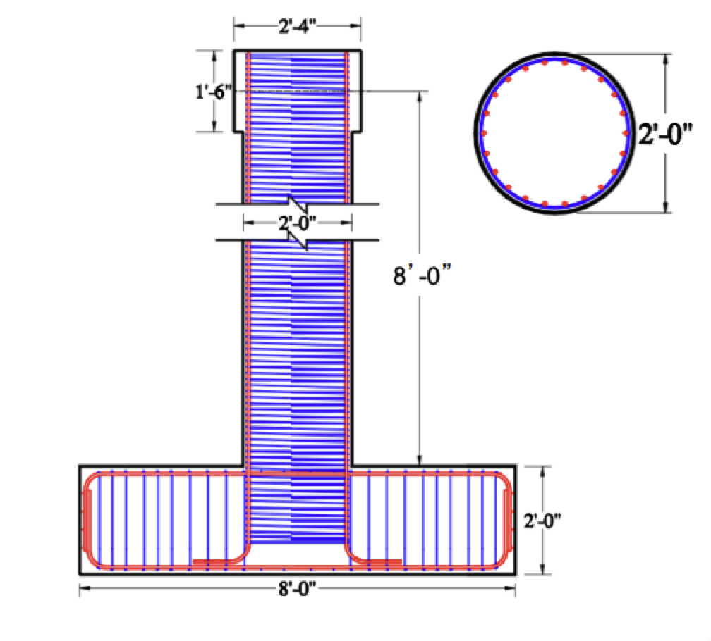

Investigate the two most commonly used OpenSees elements for modeling beam-column
elements: the force-based element (FBE) and displacement-based element (DBE). 

Although the OpenSees command for defining these two elements has the
same arguments, a beam-column element needs to be modeled differently
using these two elements to achieve a comparable level of accuracy. The
intent of this seminar is to show users how to properly model
beam-column elements with both FBE and DBE. The theory behind these two
elements along with two examples will be presented to users to enhance
their understanding of the elements and assure their correct
application. 

|    |     |
| :--- | :--- |
| Diameter | 24 in. |
| Height | 96 in. |
| Longitudinal | $22 \# 5 \mathrm{Gr} 60$ |
| Reinforcement | $\left(\rho_{\mathrm{l}}=1.5 \%\right)$ |
|  | $f_y=70 \mathrm{ksi}$ |
| Transverse | $\# 2 @ 1.25 \mathrm{in}$. |
| Reinforcement | $\left(\rho_{\mathrm{t}}=0.7 \%\right)$ |
|               | $f_y=96.6 ksi$ |
| Concrete | $f'_c=4.4 \mathrm{ksi}$ |

## Model Generation

- The column is modeled using finite elements, with either force-based or displacement-based elements.
- The column height (<code>HCol</code>) is 96 inches, and the diameter (<code>DCol</code>) is 24 inches.
- The clear cover of concrete (<code>clearCover</code>) is 0.75 inches.
- The column is divided into finite elements, each with a height of <code>HEle</code>.
- The area of the column cross-section (<code>ACol</code>) is calculated based on the diameter.

## Boundary Conditions

- Node 1 is fixed in both horizontal and vertical directions.
- Coordinate transformation is applied using the Corotational method.

## Materials

### Longitudinal reinforcement:

<li>Bar area (<code>barArea</code>) is 0.31 square inches (for bar #5).
<li>Bar diameter (<code>db</code>) is 0.625 inches.
<li>Yield strength (<code>fy</code>) of longitudinal bars is 70 ksi.
<li>Modulus of elasticity (<code>Es</code>) of steel is 29,000 ksi.
<li>Tangent at initial strain hardening (<code>Esf</code>) is calibrated from coupon tests.

### Transverse reinforcement:

- Spiral diameter (<code>dh</code>) is 0.25 inches.
- Number of hoops (<code>NoHoops</code>) is 1.
- Area of transverse reinforcement bar (<code>Asp1</code>) is 0.0491 square inches.
- Centerline distance between spirals (<code>stran</code>) is 1.25 inches.
- Yield strength of the hoop (<code>fyh</code>) is 96.6 ksi.

### Unconfined concrete

- Compressive strength (<code>fc</code>) is 4.4 ksi.
- Strain corresponding to <code>fc</code> is <code>eps0</code>.
- Ultimate strain for unconfined concrete is <code>epss</code>.
- Elastic modulus (<code>Ec</code>) is calculated based on ACI building code.

### Confined concrete:

- Compressive strength and strain are determined using Mander’s equations.

## Resources

The slides from the original presentation can be downloaded <a href="https://opensees.berkeley.edu/wiki/images/c/c5/FBEvsDBE.pdf">here</a>

Video of the seminar can be found here: <a href="http://www.youtube.com/watch?v=yk-1k2aF53E">FBE vs.
DBE</a>

<strong>OpenSees files used to demonstrate the effect of rigid
constraints can be found here:</strong>

<ul>
<li>The main file that is to be sourced from the OpenSees interpreter:
<ul>
<li><a href="ConventionalColumn_Cyclic.tcl"
title="wikilink">ConventionalColumn_Cyclic.tcl</a>
</ul>
<li>Supporting files to be stored in the same folder with the main file:
<ul>
<li><a href="LibUnits.tcl" title="wikilink">LibUnits.tcl</a> (define
system of units)
<li><a href="SingleCycle.tcl" title="wikilink">SingleCycle.tcl</a>
(procedure for writing one cycle of displacement history)
<li><a href="Media:_leh415.xls" title="wikilink">leh415.xls</a>
(experimental force-displacement response)
</ul>
</ul>
