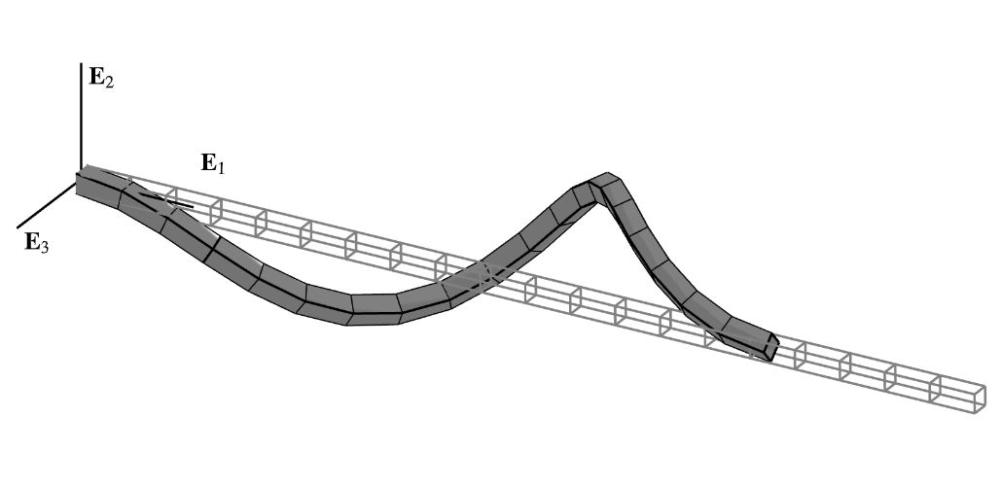
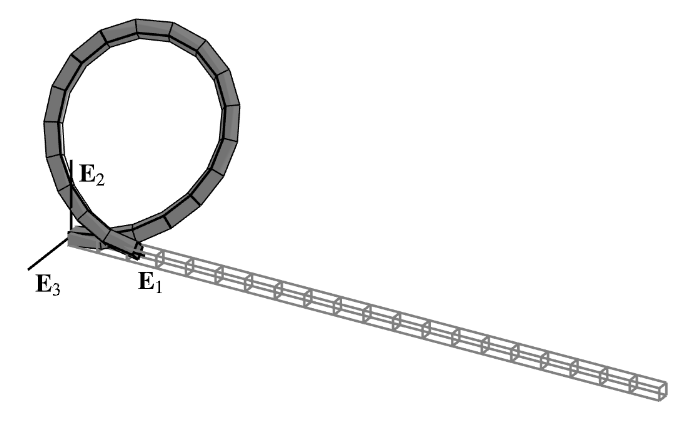

The hockling shaft (rendered above using the [`veux`](https://stairlab.berkeley.edu/software/veux) library)
is a particularly complex problem that arises from practical considerations for the design of propeller shafts in
large ships <cite keys="rosenthal1976application, oreilly2017modeling"></cite>. 
This post follows from the work by <cite key="perez2024nonlinear"></cite>.
The problem is posed as a propped cantilever with a torque $T\,\mathbf{E}_1$
applied at its end \(\xi = L\). 
The rod is fixed at the origin and is free to translate along the $\mathbf{E}_1$ direction at its end. 

This problem was investigated analytically by
<cite keys="greenhill1883strength, ziegler1977principles"></cite> who found an *approximate* minimum buckling torque $T_{\mathrm{cr}}$ given by:
\[
T_{\mathrm{cr}} = \lambda_{\text{cr}} \frac{2 EI}{L}
\qquad\text{ where }\qquad
\lambda_{\text{cr}}  = \min  \left\{\lambda  \mid \tan \lambda - \lambda = 0\right\} \approx \pm 4.493409
\]
<cite key="ziegler1977principles"></cite> reports the value
\(\lambda_{\text{cr}} \approx \pm 4.494\), which is commonly used in the
literature. Because the loaded end is constrained to rotate about a
fixed axis, all rotation parameterizations coincide at this node so
that, in all cases, the moment can be applied by simple scaling of a
reference vector.

The following parameters are commonly adopted for the problem
<cite keys="nour-omid1991finite, saleeb1992effective"></cite>
\[
\begin{array}{lcr}
    L &=&   240 \\ %   ,& A  &= 10 \\
    E &=& 71240 \\ %   ,& I  &= 0.0833 \\
    G &=& 27190 \\ %   ,& J  &= 2.16 \\
\end{array}
\qquad\qquad
\begin{array}{lcr}
    A &=& 10\hphantom{.0833}  \\
    I &=& 0.0833 \\
    J &=& 2.16\hphantom{33}   \\
\end{array}
\]
To induce bifurcation, the undeformed centerline
$\boldsymbol{x}_0(\xi)$ is slightly rotated off the axis of the roller
reaction:
$$
\boldsymbol{x}_0(\xi) = \xi \operatorname{Exp}\begin{pmatrix}
  0 \\ 10^{-3} \\ 0
\end{pmatrix} \mathbf{E}_1 .
$$
The simulation uses a discretization of
20 elements for the rod, and the torque is applied in 65 increments with
iterative and incremental load factor control. The analysis uses the
`SFIN` isometry with both `None` and `Incr` interpolation and
parameterization variants.
Figure [2](#fig:hockle-plot){reference-type="ref"
reference="fig:hockle-plot"} shows the relation between load factor
$\lambda$ and end rotation
$\vartheta = \|\operatorname{Log}\boldsymbol{\Lambda}(L)\|$. This figure
shows that the buckling load of the simulation is slightly higher than
the value derived by <cite key="ziegler1977principles"></cite>, but is consistent with
findings for geometrically exact elements in the literature
<cite keys="nour-omid1991finite, ibrahimbegović1996role, saleeb1992effective, santos2011hybridmixed"></cite>.

<figure id="fig:hockling">
<figure>

<figcaption><em>τ</em> = 20</figcaption>
</figure>
<figure>

<figcaption><em>τ</em> = 60</figcaption>
</figure>
<figcaption>Deformed shapes of hockling rod at various pseudo-time steps
<em>τ</em>.</figcaption>
</figure>

# References

