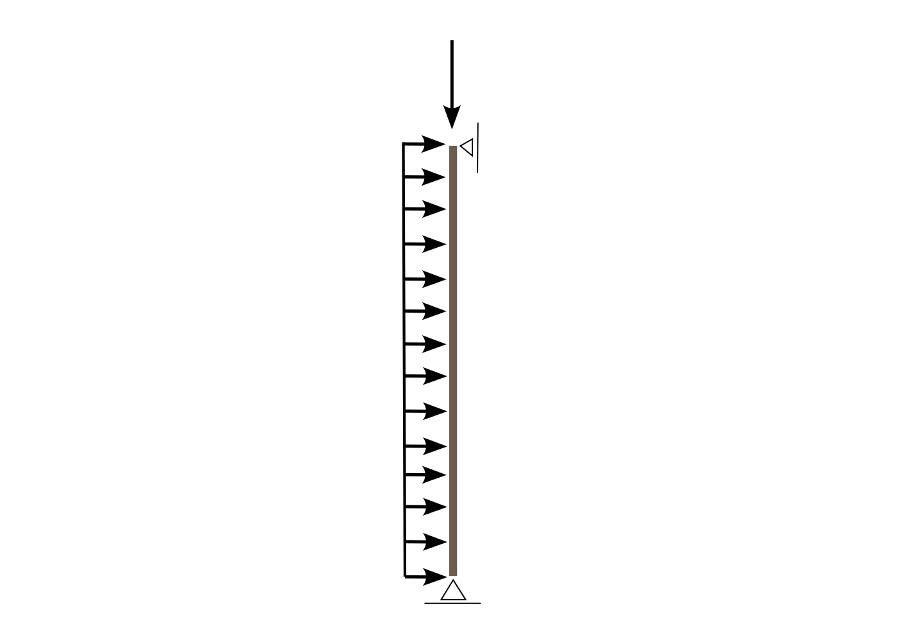

- [Case_1.py](./Case_1.py)
- [Case_2.py](./Case_2.py)

This example implements the analysis presented in the AISC steel mannual.

The source code for this example is adapted from https://github.com/denavit/OpenSees-Examples

