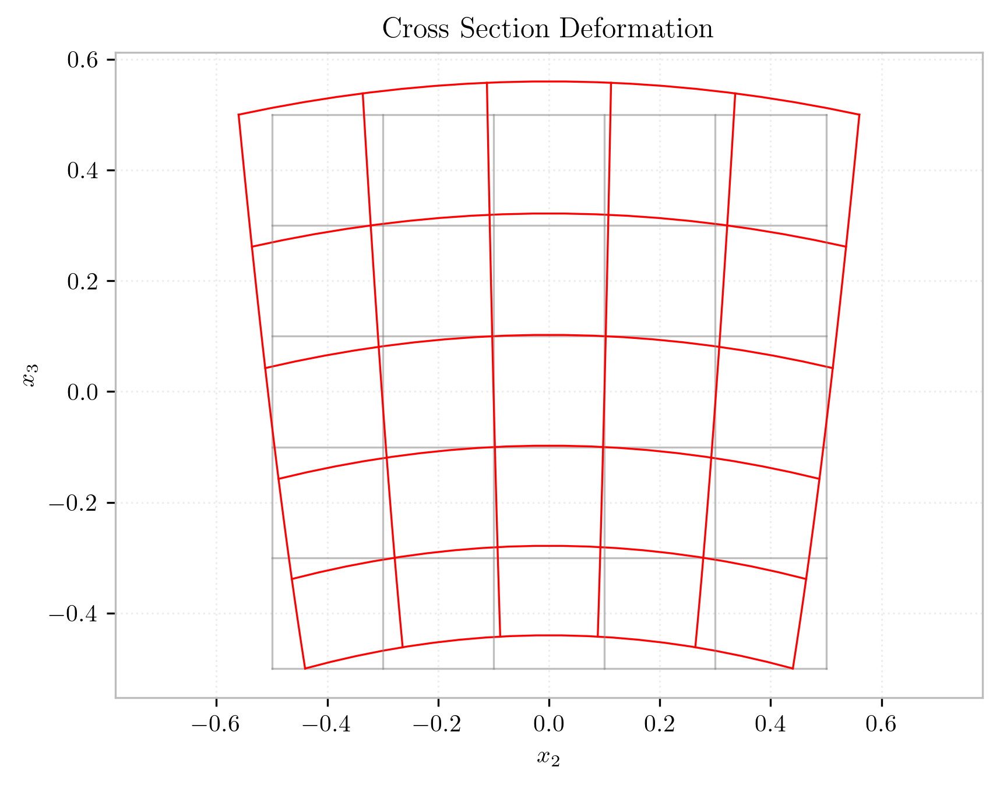
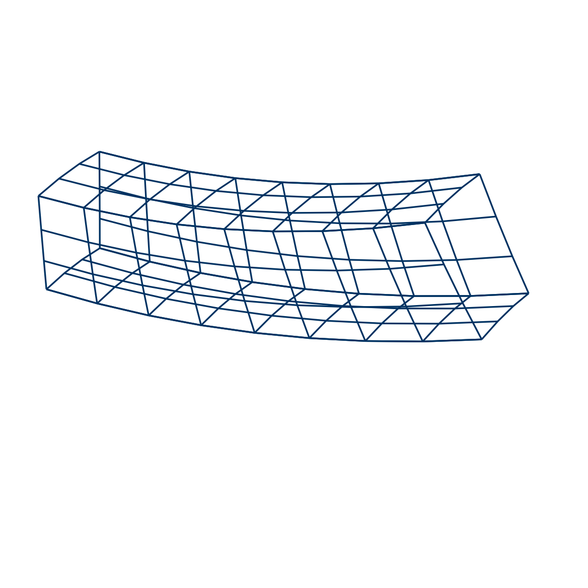
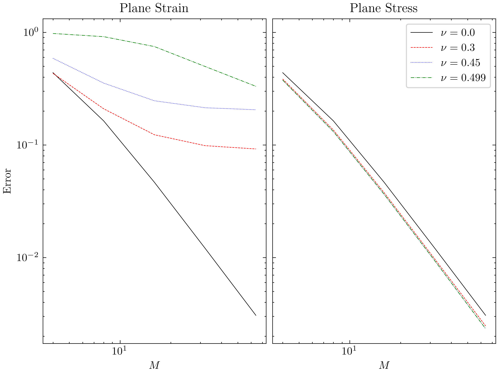
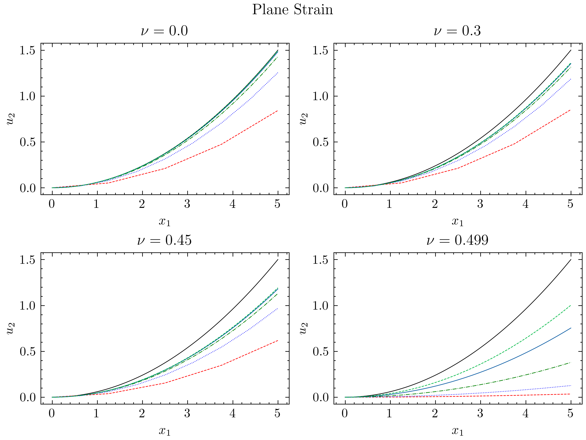
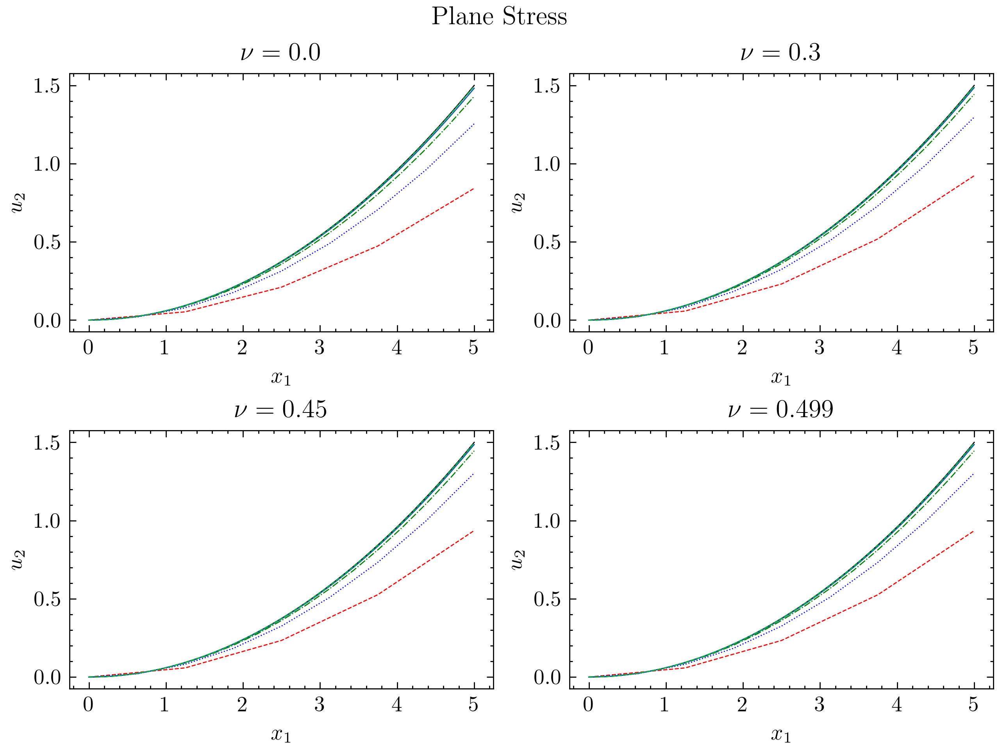

Bilinear quadrilateral elements are used to solve the pure bending problem. 
For our simulations we'll consider a beam of depth $d=1$ and length $L=5$. 
The left end has the horizontal displacements restrained to zero for all nodes, and the vertical displacement is fixed to zero at the center node only. 
The right end is to be loaded by a pure bending moment of value 1. 
Use full quadrature $(2 \times 2)$.

Let $E=100$ and consider values for $\nu$ of $0,0.3,0.45$, and $0.499$. 
For each of these values, perform a convergence analysis with meshes consisting of $2 \times 4,4 \times 8,8 \times 16$ and $16 \times 32$ elements. 
Plot the relative error of the tip vertical deflection (middle node of the right end), when compared with the exact solution of the thin-beam theory (note that we  consider plane strain conditions), versus the number of elements along the length for each Poisson ratio. 
You should note the tendency to lock for the higher Poisson ratios.

The exact 3D solution is given by:

$$
\begin{aligned}
u_2 &= -xy/R \\ 
u_y &=  yz/R \\ 
u_z &=  (\nu x^2 + y^2 - z^2)/R
\end{aligned}
$$

with $R = \tfrac{1}{12} Ed^3$.

<figure>

<figcaption>Deformed cross section from 3D solution of pure flexure.</figcaption>
</figure>
  

Note:

- For this case, both the Euler and Timoshenko theories
  are equivalent.
- The classical Euler solution to this problem is an exact solution
  to the continuum mechanics problem, provided transverse strains are not
  constrained in the plane. This was first shown by Saint Venant
  in his treatise on Torsion [@timoshenko1983history].

# 3D Bricks

# Plane Strain

# Plane Stress

