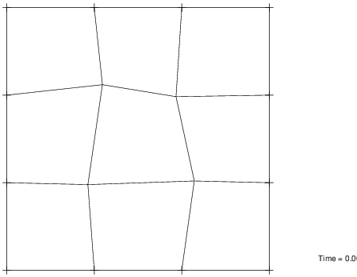
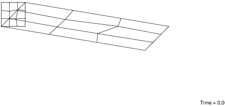

Consider the domain $[0,1] \times[0,1]$ in plane strain, and the following displacement field

$$
\begin{aligned}
u_1\left(X_1, X_2\right) &=5 X_1+X_2 \\
u_2\left(X_1, X_2\right) &=-X_1
\end{aligned}
$$

Consider a mesh of three elements per side, with rectangular and distorted shapes (i.e. general quadrilaterals). 
Consider an isotropic linear elastic material with Young modulus $E=100$ and $\nu=0.3$

## Closed form

Note that the above displacement field satisfies the equilibrium equations with zero body force.
The corresponding strain field is:
$$
\begin{aligned}
\varepsilon_{ij} &= \frac{1}{2}\left(u_{i,j} + u_{j,i}\right) \\
                 &= \begin{pmatrix}
                    5 & 0 \\
                    0 & 0
                    \end{pmatrix} \\
\end{aligned}
$$

In *plane strain*, an isotropic material is governed by the following constitutive relation:
$$
\begin{aligned}
\sigma_{\alpha \beta}&=\frac{E}{(1+\nu)}\left(\epsilon_{\alpha \beta}+\frac{\nu}{(1-2 \nu)}\left(\epsilon_{\gamma \gamma}\right) \delta_{\alpha \beta}\right) \\
\end{aligned}
$$
This furnishes for the stress
$$
\begin{aligned}
\begin{pmatrix}
\sigma_{11} \\
\sigma_{22} \\
\sigma_{12}
\end{pmatrix}
%&=\frac{E}{(1+\nu)(1-2 \nu)} \begin{pmatrix}
%  1-\nu & \nu & 0 \\
%  \nu & 1-\nu & 0 \\
%  0 & 0 & (1-2\nu) / 2
%  \end{pmatrix}
%  \begin{pmatrix}
%  \varepsilon_{11} \\
%  \varepsilon_{22} \\
%  2 \varepsilon_{12}
%  \end{pmatrix} \\
%
&=\frac{E}{(1+\nu)(1-2 \nu)}\begin{pmatrix}
  5  \\
  5\nu  \\
  0 
  \end{pmatrix}
&=\boxed{\begin{pmatrix} 673.07692308 \\ 288.46153846 \\ 0. \end{pmatrix}}
\end{aligned}
$$

Because this is a constant field, it follows that indeed $\operatorname{div}\boldsymbol{\sigma} = 0$.


$$
\begin{aligned}
\begin{pmatrix}
\sigma_{11} \\
\sigma_{22} \\
\sigma_{12}
\end{pmatrix}
&=\frac{E}{\left(1-\nu^2\right)}\begin{pmatrix}
  1 & \nu & 0 \\
  \nu & 1 & 0 \\
  0 & 0 & (1-\nu) / 2
  \end{pmatrix}
  \left[\begin{array}{c}
  \varepsilon_{11} \\
  \varepsilon_{22} \\
  2 \varepsilon_{12}
  \end{array}\right] \\
%
&=\frac{E}{\left(1-\nu^2\right)}\begin{pmatrix}
  5  \\
  5\nu  \\
  0 
  \end{pmatrix} \\
&=\begin{pmatrix}549.45054945 \\ 164.83516484 \\ 0.\end{pmatrix}
\end{aligned}
$$


## Test 1

> b) Restrain all the boundary nodes and specify the boundary conditions which impose the patch displacements. Run the macro program
>    ```
>    tang, , 1
>    disp, all
>    stre, all
>    reac, all
>    ```
>    and compare the numerical solution with the exact solution.


{width=50%}

{width=70%}


## Test 2

> c) Remove all the restraints on the boundary of your patch except the minimum number needed to prevent rigid body motions. For all the unrestrained boundary degrees of freedom apply the forces obtained from the reactions computed in part (b). Compare your results with those of part (b).

Displacements from the force-driven problem, along with those of part B:

|   Node |   1 Displ |   2 Displ |   1 Displ(b) |   2 Displ(b) |
|-------:|----------:|----------:|-------------:|-------------:|
|      1 |  0.00e+00 |  0.00e+00 |     0.00e+00 |     0.00e+00 |
|      2 |  1.67e+00 | -3.33e-01 |     1.67e+00 |    -3.33e-01 |
|      3 |  3.33e+00 | -6.67e-01 |     3.33e+00 |    -6.67e-01 |
|      4 |  5.00e+00 | -1.00e+00 |     5.00e+00 |    -1.00e+00 |
|      5 |  3.33e-01 |  6.57e-06 |     3.33e-01 |     0.00e+00 |
|      6 |  2.15e+00 | -3.63e-01 |     2.15e+00 |    -3.63e-01 |
|      7 |  3.42e+00 | -6.15e-01 |     3.42e+00 |    -6.15e-01 |
|      8 |  5.33e+00 | -1.00e+00 |     5.33e+00 |    -1.00e+00 |
|      9 |  6.67e-01 |  5.02e-06 |     6.67e-01 |     0.00e+00 |
|     10 |  2.35e+00 | -3.31e-01 |     2.35e+00 |    -3.31e-01 |
|     11 |  4.17e+00 | -7.09e-01 |     4.17e+00 |    -7.09e-01 |
|     12 |  5.67e+00 | -1.00e+00 |     5.67e+00 |    -1.00e+00 |
|     13 |  1.00e+00 |  2.67e-06 |     1.00e+00 |     0.00e+00 |
|     14 |  2.67e+00 | -3.33e-01 |     2.67e+00 |    -3.33e-01 |
|     15 |  4.33e+00 | -6.67e-01 |     4.33e+00 |    -6.67e-01 |
|     16 |  6.00e+00 | -1.00e+00 |     6.00e+00 |    -1.00e+00 |


<!--
```{include="Ip2c" .tcl}
```
-->

## Part D

> d) Repeat parts (b) and (c) using 1-point (reduced) quadrature to compute the element arrays. 
Compare your results with the previous ones, and comment on the differences and similarities.

The following table collects the error in the displacement-driven problem with 
reduced integration over a distorted mesh:

|   Node |   1 Displ |   1 Error |   2 Displ |   2 Error |
|-------:|----------:|----------:|----------:|----------:|
|      1 |  0.00e+00 |  0.00e+00 |  0.00e+00 |  0.00e+00 |
|      2 |  1.67e+00 | -5.00e-05 | -3.33e-01 |  0.00e+00 |
|      3 |  3.33e+00 | -5.00e-05 | -6.67e-01 |  0.00e+00 |
|      4 |  5.00e+00 |  0.00e+00 | -1.00e+00 |  0.00e+00 |
|      5 |  3.33e-01 |  0.00e+00 |  0.00e+00 |  0.00e+00 |
|      6 |  1.98e+00 |  2.22e-16 | -3.28e-01 |  1.00e-05 |
|      7 |  3.92e+00 |  0.00e+00 | -7.15e-01 |  0.00e+00 |
|      8 |  5.33e+00 |  0.00e+00 | -1.00e+00 |  0.00e+00 |
|      9 |  6.67e-01 | -3.00e-05 |  0.00e+00 |  0.00e+00 |
|     10 |  2.40e+00 | -1.00e-04 | -3.51e-01 |  2.00e-05 |
|     11 |  3.75e+00 |  1.00e-04 | -6.29e-01 | -3.00e-05 |
|     12 |  5.67e+00 |  3.00e-05 | -1.00e+00 |  0.00e+00 |
|     13 |  1.00e+00 |  0.00e+00 |  0.00e+00 |  0.00e+00 |
|     14 |  2.67e+00 |  5.00e-05 | -3.33e-01 |  0.00e+00 |
|     15 |  4.33e+00 |  5.00e-05 | -6.67e-01 |  0.00e+00 |
|     16 |  6.00e+00 |  0.00e+00 | -1.00e+00 |  0.00e+00 |

And results for the force-driven problem:

|   Node |   1 Displ |   2 Displ |   1 Displ(b) |   2 Displ(b) |
|-------:|----------:|----------:|-------------:|-------------:|
|      1 |  0.00e+00 |  0.00e+00 |     0.00e+00 |     0.00e+00 |
|      2 |  8.03e+10 |  3.61e+10 |     1.67e+00 |    -3.33e-01 |
|      3 |  3.35e+00 |  5.35e+10 |     3.33e+00 |    -6.67e-01 |
|      4 |  8.03e+10 |  8.97e+10 |     5.00e+00 |    -1.00e+00 |
|      5 |  5.35e+10 |  9.39e+09 |     3.33e-01 |     0.00e+00 |
|      6 | -2.50e+10 |  2.53e+10 |     1.88e+00 |    -3.15e-01 |
|      7 |  5.54e+10 |  6.46e+10 |     3.75e+00 |    -6.88e-01 |
|      8 | -2.68e+10 |  8.03e+10 |     5.33e+00 |    -1.00e+00 |
|      9 | -5.35e+10 | -1.98e-02 |     6.67e-01 |     0.00e+00 |
|     10 |  2.64e+10 |  3.65e+10 |     2.36e+00 |    -3.38e-01 |
|     11 | -5.33e+10 |  5.03e+10 |     3.80e+00 |    -6.26e-01 |
|     12 |  2.68e+10 |  8.97e+10 |     5.67e+00 |    -1.00e+00 |
|     13 |  1.00e+00 |  9.39e+09 |     1.00e+00 |     0.00e+00 |
|     14 | -8.03e+10 |  2.68e+10 |     2.67e+00 |    -3.33e-01 |
|     15 |  4.31e+00 |  6.29e+10 |     4.33e+00 |    -6.67e-01 |
|     16 | -8.03e+10 |  8.03e+10 |     6.00e+00 |    -1.00e+00 |


