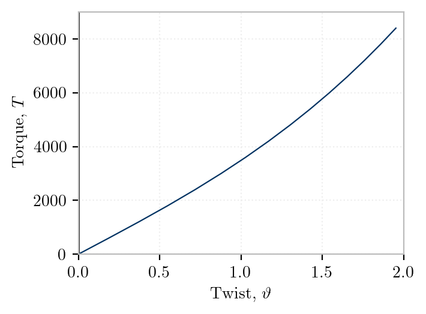

Rectangle, pure torsion (no instability), unconstrained warping, <cite keys="battini2002corotational, rinchen2016formulation"></cite>. 

Nonuniform constrained warping was considered by <cite keys="zhang2011formulation"></cite>

- Wen Yi Lin; Kuo Mo Hsiao. (2001). Co-rotational formulation for geometric nonlinear analysis of doubly symmetric thin-walled beams. , 190(45), 6023–6052. doi:10.1016/s0045-7825(01)00212-2

- @trahair2005nonlinear
- Battini et al. (2002a), example 7.4
- @du2021threedimensional



# References

