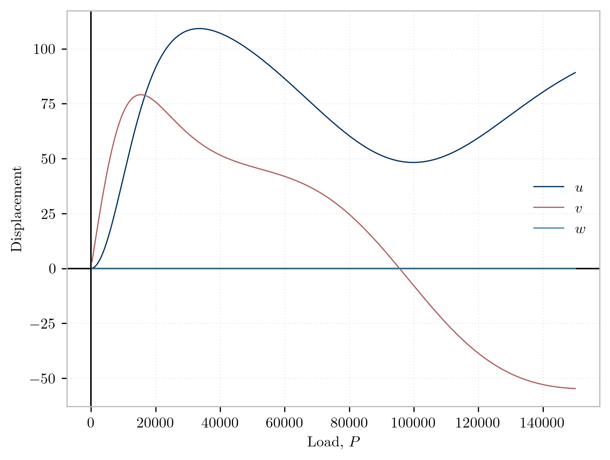

This example demonstrates the simulation of *follower loading* applied to frame elements.
This is modeled using [`FrameLoad`](https://opensees.stairlab.io/user/manual/model/elements/frame/FrameLoad.html).
