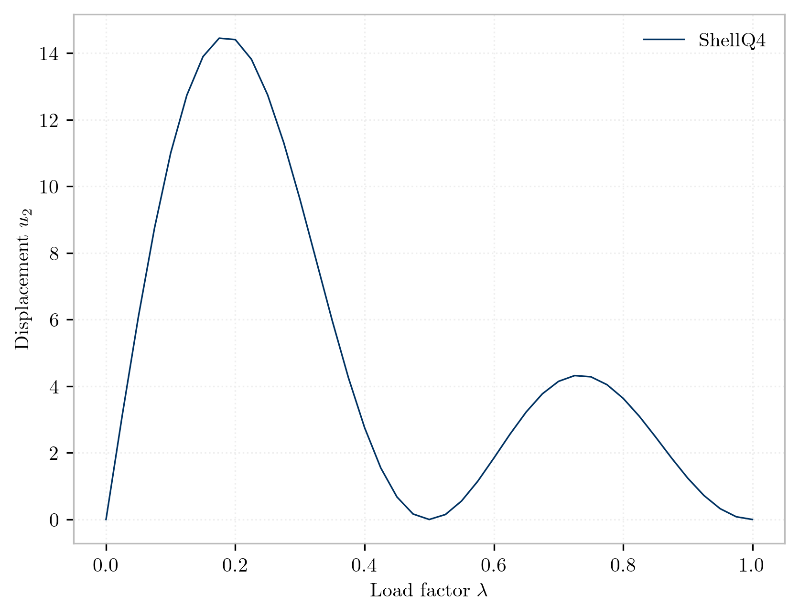

Here we investigate the roll-up problem previously considered for [frames](../framecircle), now with corotational shells.

Next we create an [`ElasticShell`](https://opensees.stairlab.io/user/manual/section/ElasticShell.html) section.


{}
```python
#                                           tag E   nu     h    rho
model.section("ElasticShell", 1, E, 0.25, 1.175, 1.27)
```
{}
{}
```tcl
# create the material
section ElasticShell  1   3.0e3  0.25  1.175  1.27
```
{}


After running the Python variant of the analysis, the following plot is generated:


