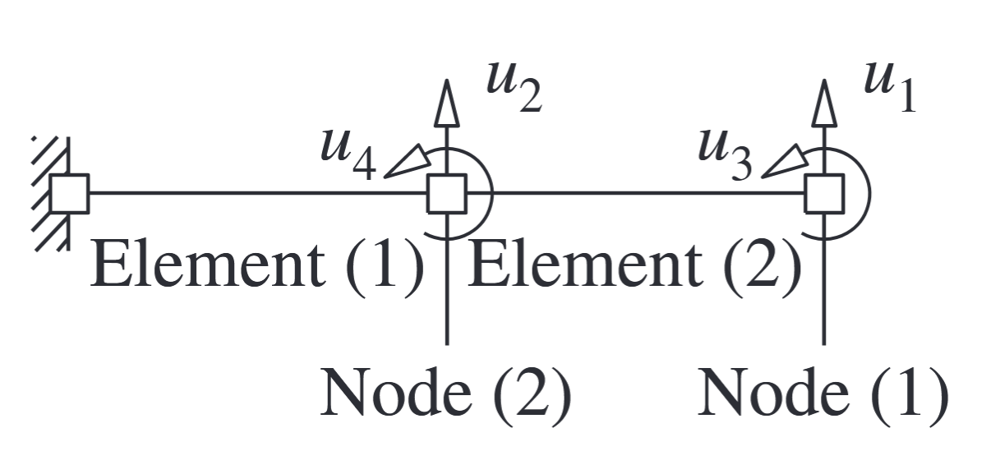

A massless cantilever beam of length $L$ supports two lumped masses $m L / 2$ and $m L / 4$ at the midpoint and free end as shown in Fig. E9.4a. The flexural rigidity of the uniform beam is $E I$. With the four DOFs chosen as shown in Fig. E9.4b and the applied forces $p_1(t)$ and $p_2(t)$, formulate the equations of motion of the system. Axial and shear deformations in the beam are neglected.

The beam consists of two beam elements and three nodes. The left node is constrained and each of the other two nodes has two DOFs (Fig. E9.4b). Thus, the displacement vector $\mathbf{u}=\left\langle\begin{array}{llll}u_1 & u_2 & u_3 & u_4\end{array}\right\rangle^T$.



### Determine the mass matrix. 
With the DOFs defined at the locations of the lumped masses, the diagonal mass matrix is given by Eq. (9.2.10):

$$
\mathbf{m}=\left[\begin{array}{llll}
m L / 4 & & & \\
& m L / 2 & & \\
& & 0 & \\
& & & 0
\end{array}\right]
$$

### Determine the stiffness matrix. 
Several methods are available to determine the stiffness matrix. Here we use the direct equilibrium method based on the definition of stiffness influence coefficients (Appendix 1).

To obtain the first column of the stiffness matrix, we impose $u_1=1$ and $u_2=u_3=$ $u_4=0$. The stiffness influence coefficients are $k_{i 1}$ (Fig. E9.4c). The forces necessary at the nodes of each beam element to maintain the deflected shape are determined from the beam stiffness coefficients (Fig. E9.4d). The two sets of forces in figures (c) and (d) are one and the same. Thus $k_{11}=96 E I / L^3, k_{21}=-96 E I / L^3, k_{31}=-24 E I / L^2$, and $k_{41}=-24 E I / L^2$.

The second column of the stiffness matrix is obtained in a similar manner by imposing $u_2=1$ with $u_1=u_3=u_4=0$. The stiffness influence coefficients are $k_{i 2}$ (Fig. E9.4e) and the forces on each beam element necessary to maintain the imposed displacements are shown in Fig. E9.4f. The two sets of forces in figures (e) and (f) are one and the same. Thus $k_{12}=-96 E I / L^3, k_{32}=24 E I / L^2, k_{22}=96 E I / L^3+96 E I / L^3=192 E I / L^3$, and $k_{42}=-24 E I / L^2+24 E I / L^2=0$.

The third column of the stiffness matrix is obtained in a similar manner by imposing $u_3=1$ with $u_1=u_2=u_4=0$. The stiffness influence coefficients $k_{i 3}$ are shown in Fig. E9.4g and the nodal forces in Fig. E9.4h. Thus $k_{13}=-24 E I / L^2, k_{23}=24 E I / L^2$, $k_{33}=8 E I / L$, and $k_{43}=4 E I / L$.

The fourth column of the stiffness matrix is obtained in a similar manner by imposing
$u_4=1$ with $u_1=u_2=u_3=0$. The stiffness influence coefficients $k_{i 4}$ are shown in Fig. E9.4i, and the nodal forces in Fig. E9.4j. Thus $k_{14}=-24 E I / L^2, k_{34}=4 E I / L, k_{24}=$ $-24 E I / L^2+24 E I / L^2=0$, and $k_{44}=8 E I / L+8 E I / L=16 E I / L$.

With all the stiffness influence coefficients determined, the stiffness matrix is

$$
\mathbf{k}=\frac{8 E I}{L^3}\left[\begin{array}{rccc}
12 & -12 & -3 L & -3 L \\
-12 & 24 & 3 L & 0 \\
-3 L & 3 L & L^2 & L^2 / 2 \\
-3 L & 0 & L^2 / 2 & 2 L^2
\end{array}\right]
$$

### Determine the equations of motion. 

The governing equations are

$$
\mathbf{m} \ddot{\mathbf{u}}+\mathbf{k} \mathbf{u}=\mathbf{p}(t)
$$

where $\mathbf{m}$ and $\mathbf{k}$ are given by Eqs. (a) and (b), and $\mathbf{p}(t)=\left\langle\begin{array}{llll}p_1(t) & p_2(t) & 0 & 0\end{array}\right\rangle^T$.

### Condensation

Solution The vector of four DOFs is partitioned in two parts: $\mathbf{u}_t=\left\langle\begin{array}{ll}u_1 & u_2\end{array}\right\rangle^T$ and $\mathbf{u}_0=$ $\left\langle\begin{array}{ll}u_3 & u_4\end{array}\right\rangle^T$. The equations of motion governing $\mathbf{u}_t$ are given by Eq. (9.3.4), where

$$
\mathbf{m}_{t t}=\left[\begin{array}{ll}
m L / 4 & \\
& m L / 2
\end{array}\right] \quad \mathbf{p}_t(t)=\left\langle\begin{array}{ll}
p_1(t) & \left.p_2(t)\right\rangle^T
\end{array}\right.
$$

To determine $\hat{\mathbf{k}}_{t t}$, the $4 \times 4$ stiffness matrix determined in Example 9.4 is partitioned:

$$
\mathbf{k}=\left[\begin{array}{ll}
\mathbf{k}_{t t} & \mathbf{k}_{t 0} \\
\mathbf{k}_{0 t} & \mathbf{k}_{00}
\end{array}\right]=\frac{8 E I}{L^3}\left[\begin{array}{cc:cc}
12 & -12 & -3 L & -3 L \\
-12 & 24 & 3 L & 0 \\
\hdashline-3 L & 3 L & L^2 & L^2 / 2 \\
-3 L & 0 & L^2 / 2 & 2 L^2
\end{array}\right]
$$

Substituting these submatrices in Eq. (9.3.5) gives the condensed stiffness matrix:

$$
\hat{\mathbf{k}}_{t t}=\frac{48 E I}{7 L^3}\left[\begin{array}{rr}
2 & -5 \\
-5 & 16
\end{array}\right]
$$

This stiffness matrix of Eq. (c) is the same as that obtained in Example 9.5 by inverting the flexibility matrix corresponding to the two translational DOFs.

Substituting the stiffness submatrices in Eq. (9.3.3) gives the relation between the condensed DOF $\mathbf{u}_0$ and the dynamic DOF $\mathbf{u}_t$ :

$$
\mathbf{u}_0=\mathbf{T u}_t \quad \mathbf{T}=\frac{1}{L}\left[\begin{array}{lc}
2.57 & -3.43 \\
0.857 & 0.857
\end{array}\right]
$$

The equations of motion are given by Eq. (9.3.4), where $\mathbf{m}_{t t}$ and $\mathbf{p}_t(t)$ are defined in Eq. (a) and $\hat{\mathbf{k}}_{t t}$ in Eq. (c). 
These are the same as Eq. (c) of Example 9.5.
