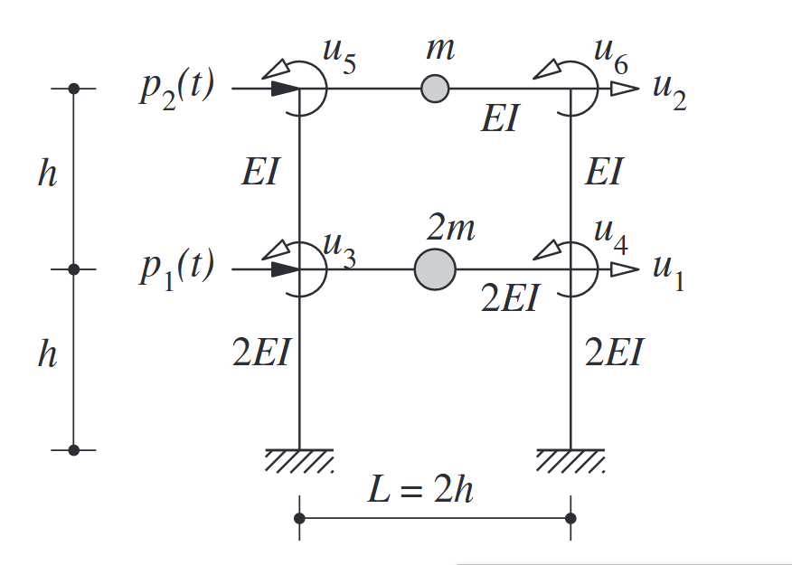
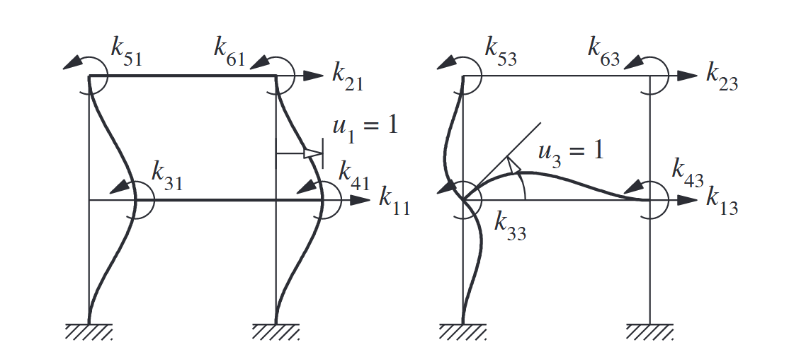

Formulate the equations of motion for the two-story frame in Fig. E9.7a. The flexural rigidity of the beams and columns and the lumped masses at the floor levels are as noted. 
The dynamic excitation consists of lateral forces $p_1(t)$ and $p_2(t)$ at the two floor levels. 
The story height is $h$ and the bay width $2 h$. 
Neglect axial deformations in the beams and the columns.

The system has six degrees of freedom shown in Fig. E9.7a: lateral displacements $u_1$ and $u_2$ of the floors and joint rotations $u_3, u_4, u_5$, and $u_6$. The displacement vector is

$$
\mathbf{u}=\left\langle\begin{array}{llllll}
u_1 & u_2 & u_3 & u_4 & u_5 & u_6
\end{array}\right\rangle^T
$$

The mass matrix is given by:

$$
\mathbf{m}=m\left[\begin{array}{llllll}
2 & & & & & \\
& 1 & & & & \\
& & 0 & & & \\
& & & 0 & & \\
& & & & 0 & \\
& & & & & 0
\end{array}\right]
$$

The stiffness influence coefficients are evaluated following the procedure of Example 9.4. 
A unit displacement is imposed, one at a time, in each DOF while constraining the other five DOFs, and the stiffness influence coefficients (e.g., shown in Fig. E9.7b and c for $u_1=1$ and $u_3=1$, respectively) are calculated by statics from the nodal forces for individual structural elements associated with the displacements imposed. 
These nodal forces are determined from the beam stiffness coefficients (Appendix 1). 
The result is

$$
\mathbf{k}=\frac{E I}{h^3}\left[\begin{array}{rrcccr}
72 & -24 & 6 h & 6 h & -6 h & -6 h \\
-24 & 24 & 6 h & 6 h & 6 h & 6 h \\
6 h & 6 h & 16 h^2 & 2 h^2 & 2 h^2 & 0 \\
6 h & 6 h & 2 h^2 & 16 h^2 & 0 & 2 h^2 \\
-6 h & 6 h & 2 h^2 & 0 & 6 h^2 & h^2 \\
-6 h & 6 h & 0 & 2 h^2 & h^2 & 6 h^2
\end{array}\right]
$$

The dynamic forces applied are lateral forces $p_1(t)$ and $p_2(t)$ at the two floors without any moments at the nodes. 
Thus the applied force vector is

$$
\mathbf{p}(t)=\left\langle p_1(t) \quad p_2(t) \quad 0 \quad 0 \quad 0 \quad 0 \quad 0\right\rangle^T
$$

The equations of motion are

$$
\mathbf{m} \ddot{\mathbf{u}}+\mathbf{k} \mathbf{u}=\mathbf{p}(t)
$$

where $\mathbf{u}, \mathbf{m}, \mathbf{k}$, and $\mathbf{p}(t)$ are given by Eqs. (a), (b), (c), and (d), respectively.

### Condensation

Formulate the equations of motion for the two-story frame of Example 9.7 governing the lateral floor displacements $u_1$ and $u_2$.

Solution The equations of motion for this system were formulated in Example 9.7 considering six DOFs which are partitioned into $\mathbf{u}_t=\left\langle\begin{array}{lllll}u_1 & u_2\end{array}\right\rangle^T$ and $\mathbf{u}_0=\left\langle\begin{array}{llll}u_3 & u_4 & u_5 & u_6\end{array}\right\rangle^T$.

The equations governing $\mathbf{u}_t$ are given by Eq. (9.3.4), where

$$
\mathbf{m}_{t t}=m\left[\begin{array}{ll}
2 & \\
& 1
\end{array}\right] \quad \mathbf{p}_t(t)=\left\langle\begin{array}{ll}
p_1(t) & \left.p_2(t)\right\rangle^T
\end{array}\right.
$$

To determine $\mathbf{k}_{t t}$, the $6 \times 6$ stiffness matrix determined in Example 9.7 is partitioned:

$$
\mathbf{k}=\left[\begin{array}{ll}
\mathbf{k}_{t t} & \mathbf{k}_{t 0} \\
\mathbf{k}_{0 t} & \mathbf{k}_{00}
\end{array}\right]=\frac{E I}{h^3}\left[\begin{array}{rr:cccc}
72 & -24 & 6 h & 6 h & -6 h & -6 h \\
-24 & 24 & 6 h & 6 h & 6 h & 6 h \\
\hdashline 6 h & 6 h & 16 h^2 & 2 h^2 & 2 h^2 & 0 \\
6 h & 6 h & 2 h^2 & 16 h^2 & 0 & 2 h^2 \\
-6 h & 6 h & 2 h^2 & 0 & 6 h^2 & h^2 \\
-6 h & 6 h & 0 & 2 h^2 & h^2 & 6 h^2
\end{array}\right]
$$

Substituting these submatrices in Eq. (9.3.5) gives the condensed stiffness matrix:

$$
\hat{\mathbf{k}}_{t t}=\frac{E I}{h^3}\left[\begin{array}{rr}
54.88 & -17.51 \\
-17.51 & 11.61
\end{array}\right]
$$

This is called the lateral stiffness matrix because the DOFs are the lateral displacements of the floors. It enters into the earthquake analysis of buildings (Section 9.4).

Substituting the stiffness submatrices in Eq. (9.3.3) gives the relation between the condensed DOF $\mathbf{u}_0$ and the translational DOF $\mathbf{u}_t$ :

$$
\mathbf{u}_0=\mathbf{T u}_t \quad \mathbf{T}=\frac{1}{h}\left[\begin{array}{rr}
-0.4426 & -0.2459 \\
-0.4426 & -0.2459 \\
0.9836 & -0.7869 \\
0.9836 & -0.7869
\end{array}\right]
$$

The equations of motion are given by Eq. (9.3.4), where $\mathbf{m}_{t t}$ and $\mathbf{p}_t$ are defined in Eq. (a) and $\hat{\mathbf{k}}_{t t}$ in Eq. (c):

$$
m\left[\begin{array}{ll}
2 & \\
& 1
\end{array}\right]\left\{\begin{array}{l}
\ddot{u}_1 \\
\ddot{u}_2
\end{array}\right\}+\frac{E I}{h^3}\left[\begin{array}{rr}
54.88 & -17.51 \\
-17.51 & 11.61
\end{array}\right]\left\{\begin{array}{l}
u_1 \\
u_2
\end{array}\right\}=\left\{\begin{array}{l}
p_1(t) \\
p_2(t)
\end{array}\right\}
$$
