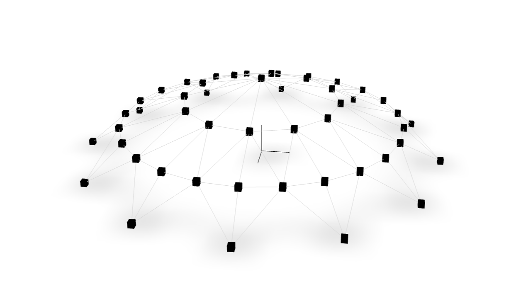
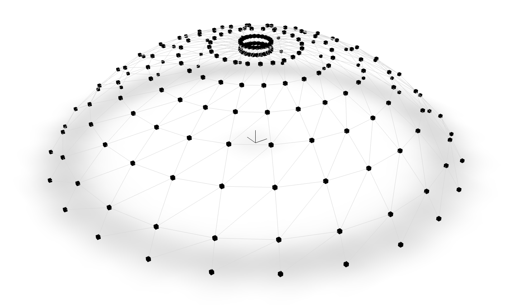
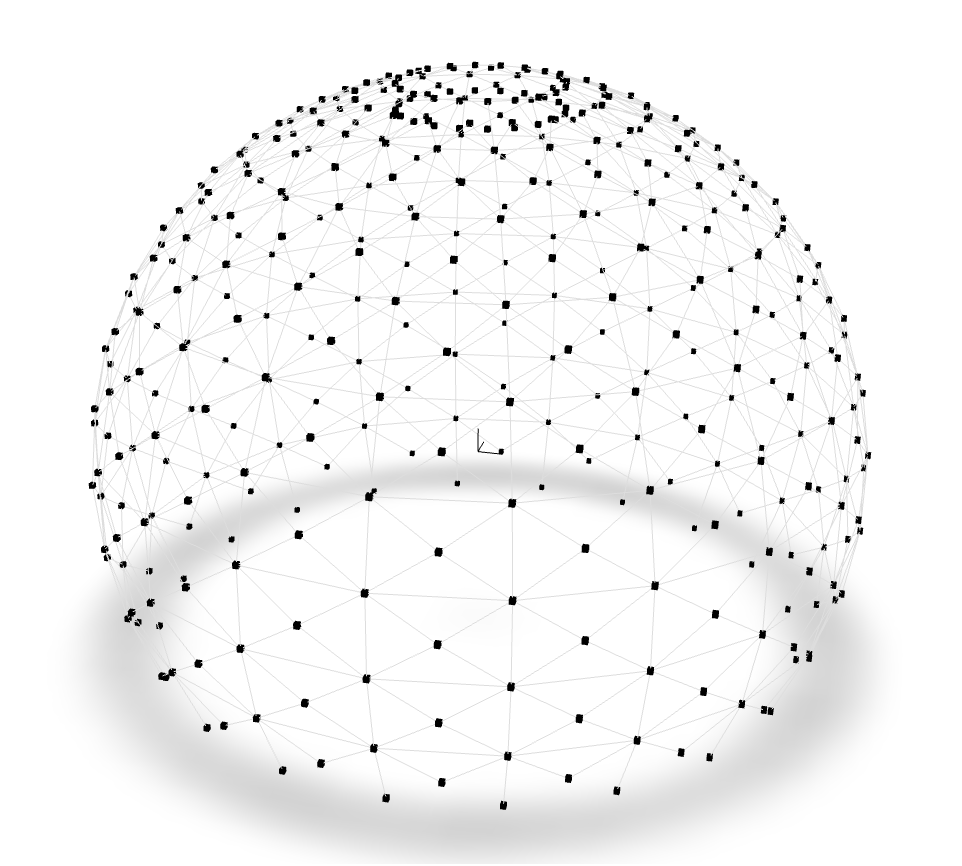

A variety of periodic truss structures are investigated. This class of
models was investigated by <cite key="kaveh2010optimum"></cite>.
All figures have been produced with [`veux`](https://veux.io).


  
   
   This model is investigated by <cite keys="kaveh2010optimum, lieu2018adaptive"></cite>.

   ```python
   model = create_dome("120")
   ```

  
  

   
   This model is investigated by <cite key="kaveh2022optimal"></cite>

  
  
  This model is investigated by <cite key="kaveh2010optimum"></cite>
  
  


This model is investigated by <cite key="kaveh2022optimal"></cite>
  



The following code block contains the source code used to generate these
models. In particular, the function `revolve()` takes a representative segment
and generates a full model by revolving the nodes and elements.



# References

<div id="bibliography-list"></div>

