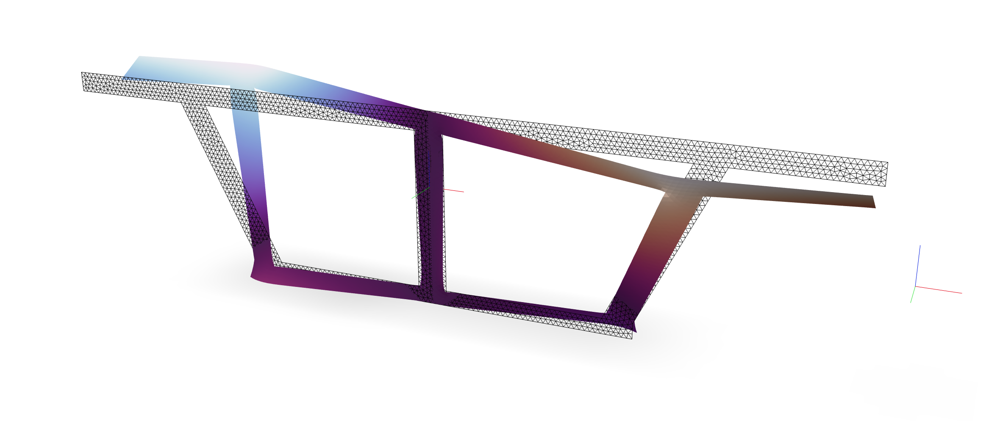

<!--

-->

Here we consider the St. Venant's torsion problem. 

$$
\begin{aligned}
\operatorname{div} \bm{S} &= \bm{0} \\
\bm{S}\mathbf{n} &= \bm{0} \qquad\forall\quad \partial \Omega_{\xi} \\
\end{aligned}
$$

$$
\begin{array}{rll}
(\nabla \cdot \nabla) \varphi &=0 & \text { in } \Omega, \\
\nabla_{\mathbf{n}} \varphi  &=-\mathbf{i} \times \bm{\zeta} \cdot \mathbf{n} & \text { on } \partial \Omega
\end{array}
$$

For this problem, `ndm=2` and `ndf=1`.



