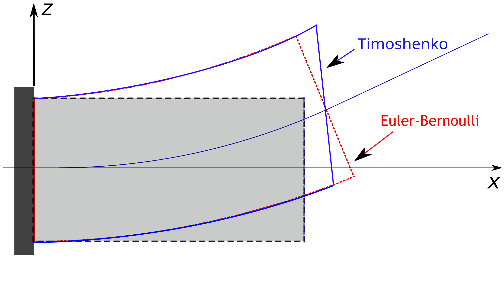

<figure style="text-align: center;">

<figcaption>Shear deformations in beams (Adapted from <a href="https://commons.wikimedia.org/wiki/File:TimoshenkoBeam.svg">Wikipedia</a>).</figcaption>
</figure>


## Introduction

This page introduces three cross sectional models for the frame elements in *xara*. 
There are four primary beam formulations available in xara:
there are four beam elements: 

- [`PrismFrame`](https://xara.so/user/manual/elements/frame/PrismFrame.html) is a standard prismatic linear elastic beam.
- [`ForceFrame`](https://xara.so/user/manual/elements/frame/ForceFrame.html) is a force-interpolated distributed inelasticity element. 
- [`ExactFrame`](https://xara.so/user/manual/elements/frame/ExactFrame.html) is a geometrically exact displacement-interpolated distributed inelasticity element.
- `CubicFrame` is a displacement-interpolated distributed inelasticity formulation.

Each of these follows the same construction syntax:
```python
model.element(name, tag, nodes, section, transform, shear=None)
```
where:
- `name` is a string identifying the name of the element (eg, `"PrismFrame"`, `"ForceFrame"`, etc.).
- `tag` is a unique integer tag which is used to identify the element in post-processing.
- `nodes` is a tuple of integers identifying previously defined nodes which the element connects to. (PrismFrame, CubicFrame and ForceFrame accept **2** node tags; `ExactFrame` accepts **2** to **4** nodes).
- `section` is an integer tag of a previously defined frame cross section.
- `transform` is a tag of a previously defined geometric transformation.
- `shear` is an integer flag which can be used to enable shear deformations (Timoshenko beam theory) in the `PrismFrame`, `CubicFrame`, and `ForceFrame` elements. The `ExactFrame` always includes shear deformations, and supplying `shear=0` will throw an error when this element is specified by `name`.

There are primarily three cross section types:

- `ElasticFrame`: an elastic cross section defined by specifying cross sectional integrals like $A$, $I$, $J$, $E$, G, etc,
- `AxialFiber`: a "fiber" section which is defined by a set of fibers discretizing the cross section, and specifying a uniaxial material law at each fiber
- `ShearFiber`: like ScalarFiber, but fibers are assigned *multiaxial* material laws (ie, a tensorial stress-strain relation)

There are two primary considerations that figure in selecting an appropriate cross section:
1. **Material nonlinearity**. 
2. **Shear deformability**. Shear stiffness refers to the propensity of a cross section 

## Elastic

The required constants are:
- `E`: Young's modulus
- `G`: Shear modulus
- `A`: Cross sectional area
- `Iy`, `Iz`: Second moments of area
- `J` : Saint Venant's torsion constant

```python
# Shear given by GA
model.section("ElasticFrame", 1, E=E, G=G, A=A, Iy=Iy, Iz=Iz, J=J)
# Shear given by G A ky
model.section("ElasticFrame", 1, E=E, G=G, A=A, Iy=Iy, Iz=Iz, J=J, ky=0.83)
```

```python
model.section("AxialFiber", G=G, J=J)
```

## Fiber

### Uniaxial

```python
from xara.units import si
import xsection.library as xs
# 1) Create a shape
shape = xs.from_aisc("W18x40", units=si)
# 2) Create a material
model.nDMaterial('ElasticIsotropic', 1, E, nu)

# 3) Create the section
model.section("MultiaxialFiber", 1)
# 4) populate with fibers
for fiber in shape.create_fibers():
    model.fiber(**fiber, material=1, section=1)
```

```python
from xara.units import si
import xsection.library as xs
# 1) Create a shape
shape = xs.from_aisc("W18x40", units=si)
# 2) Create a material
model.uniaxialMaterial('Elastic', 1, E)

# 3) Create the section
model.section("UniaxialFiber", 1)
# 4) populate with fibers
for fiber in shape.create_fibers():
    model.fiber(**fiber, material=1, section=1)
```

```python
from xara.units import si
import xsection.library as xs
# 1) Create a shape
shape = xs.from_aisc("W18x40", units=si)

# 3) Create the section
model.section("FrameElastic", 1)
# 4) populate with fibers
for fiber in shape.create_fibers():
    model.fiber(**fiber, material=1, section=1)
```

### Multiaxial

### Warping

