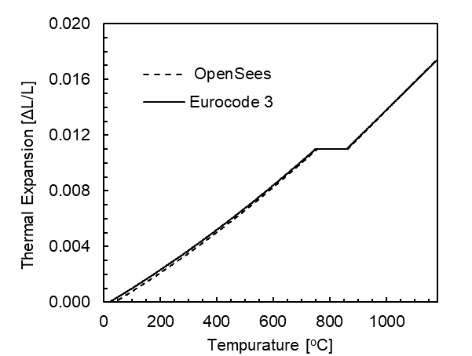

{.align-centeralign-center width="500px"}

A steel beam is heated to 1180 &deg; C. Horizontal
displacement of right end is recorded. This displacement is normalized
against the original length and plotted against temperature. The
calculated thermal expansion is compared against the steel
temperature-dependent thermal expansion in Eurocode 3, Part 1-2 \[1\].

Download Example 1 files: [`Example1.tcl`](files/Example1.tcl)

<!--
`Example 1 Outputs <files/Example1_OUTPUT.zip>`{.interpreted-text role="download"}.
-->

## Material Properties

The uniaxialMaterial Steel01Thermal includes temperature-dependent steel
thermal and mechanical properties per Eurocode 3 \[1\]. More details of
Steel01 can be found at: [Steel01 Material](https://opensees.berkeley.edu/wiki/index.php/Steel01_Material)

```tcl
uniaxialMaterial Steel01Thermal $matTag $Fy $Es $b;
```

Es = 210 GPa (Young's modulus of elasticity at ambient temperatures)

Fy = 250 MPa (Yield strength of material at ambient temperatures)

b = 0.001 (Strain-Hardening Ratio)

## Transformation

The beam is expanding in one direction, therefore, 2nd order bending
effects do not need to be considered.

```tcl
geomTransf Linear $transftag;
```

Learn more about geometric transofrmations: [Geometric
Transformation](http://opensees.berkeley.edu/wiki/index.php/Geometric_Transformation_Command)

## Section

The discretization of the steel section into four fibers is shown using
the code below:

```tcl
section FiberThermal secTag -GJ $Es {

    set numSubdivIJ 2; # horizontal
    set numSubdivJK 2; # vertical

    set yI -100; #mm
    set zI -200; #mm

    set yJ 100; #mm
    set zJ -200; #mm

    set yK 100; #mm
    set zK 200; #mm

    set yL -100; #mm
    set zL 200; #mm

    patch quad $matTag $numSubdivIJ $numSubdivJK $yI $zI $yJ $zJ $yK $zK $yL $zL
}
```

Sections that will be subjected to thermal loading must be created with
fiberThermal or fibersecThermal.

In previous versions of OpenSees, a default value for torsional
stiffness was used (GJ). In versions 3.1.0 and newer fiber sections
require a value for torsional stiffness. This is a 2D example with
negligible torsion, however a value is required. The Young\'s Modulus is
used for convenience.

**The discretization can be visualized as such:**

{.align-centeralign-center width="500px"}

**Cross section of rectangular beam showing fiber discretization**

## Elements

dispBeamColumnThermal elements are used because temperature-dependent
thermal and mechanical steel properties can be applied to these
elements. Any portion of the structure that is being heated must use
elements that are compatible with uniaxialMaterial Steel01Thermal. At
the time this model was developed, dispBeamColumnThermal was the only
element type that could have tempurature-dependent thermal and
mechanical properties applied to them.

The beam is made of one element with 5 iteration points and connects
nodes 1 & 2. OpenSees is sensitive to the number of iteration points in
each element and this could change the result of the recorded
displacement. For this reason, it is important to perform these
benchmarking examples to establish how many iteration points allows for
convergence to the expected recorded displacement. To code the number of
iteration points, we use the following syntax:


```tcl
# dispBeamColumnThermal eleTag iNode jNode numIntgrPts secTag TransfTag;
element dispBeamColumnThermal 1 1 2 5 $secTag $transftag;
```

## Output Recorders

Displacement of the end node (2) in DOF 1 (Horizontal Displacement) is
what we want to record. To do so, a folder within your working directory
must be created. `dataDir` is the command to create that folder and
should be defined at the beginning of the model. This is where your
output files will be saved.

```tcl
set dataDir Examples/EXAMPLE2_OUTPUT;

file mkdir $dataDir;

recorder Node -file $dataDir/Node2disp.out -time -node 2 -dof 1 disp;
```

Learn more about the Recorder Command: [ Recorder Command
\<http://opensees.berkeley.edu/wiki/index.php/Recorder_Command>]{.title-ref}
\_\_

## Thermal Loading

This particular model is heating a beam to a set temperature over the
time period of the model. We are not asking OpenSees to use a specific
time-temperature curve, rather linearly ramp up the temperature from
ambient to 1180 &deg; C.

Therefore, we set the maximum temperature as follows:


```tcl
set T 1180; # T = Max Tempurature (deg celcius)
```

In OpenSees, the user can define 2 or 9 temperature data points through
the cross section. In a 2D analysis framework, like this example,
temperature data point locations are specified on the y-axis of the
local coordinate system (as shown in the figure below), and are linearly
interpolated between the defined points. Because this example is using a
uniformly heated beam, the entire cross section is one temperature, and
two temperature points on each extreme fiber on the y-axis will be
chosen. The beam has a depth of 400 mm, therefore, Y1 = 200 mm & Y2 =
-200 mm for the top and bottom fibers respectively.

Location of bottom extreme fiber of beam \[mm\]

```tcl
set Y1 100;
```

Location of top extreme fiber of beam \[mm\]

```tcl
set Y2 -100;
```

{.align-centeralign-center width="500px"}

**Location of defined input temperature locations on the member cross
section**

The bottom extreme fiber temperature must be defined first. The target
maximum temperature for each extreme fiber is set to 1180\<sup>o\</sup>C
and will be increased incrementally and linearly as the time step
continues in the analysis. An external temperature data set could also
be used for more complex temperature loading. The syntax for this is:

```tcl
# Thermal loading pattern
pattern Plain 1 Linear { 
    eleLoad -ele 1 -type -beamThermal $T $Y2 $T $Y1 
}
```

## Thermal Analysis

Thermal loading is applied in 1000 steps, with a load factor of 0.001.
Each step is a 0.001 increment of the maximum temperature specified in
the thermal loading step: `T`. The analysis is a static analysis and the
contraints of the beam are plain. 1000 increments was also used during
thermal analysis to allow for easy correlation between the input
temperatures and the recorded output.

A variety of load factors were examined and the solution converged when
a load factor of 0.001 was used. OpenSees is sensitive to the load
factor, therefore, it is important to ensure that benchmarking examples
are performed to determine the proper load factor to use in structural
fire engineering analyses.

```tcl
set Nsteps 1000

set Factor [expr 1.0/$Nsteps];

integrator LoadControl $Factor;

analyze $Nsteps;
```

## Output Plots

After the model has completed running, the results will be a horizontal
displacement of the right end of the beam. Since the temperature was
linearly ramped up from ambient to 1180 &deg; C, the user can develop a
temperature history that matches every increment of the model.

Thermal expansion is the change is length divided by the original
length. This could also be called thermal strain. The thermal expansion
of the beam is plotted below and compared to the Eurocode 3
\[1\]temperature-dependent thermal expansion. We can see that the
modeled thermal expansion matches the material properties. This is
important to check that the temperatures and material properties are
assigned propertly in the model.




{.align-centeralign-center width="500px"}


## Sources

\[1\] European Committee for Standardization (CEN). (2005). Eurocode 3:
Design of Steel Structures, Part 1.2: General Rules - Structural Fire
Design.
