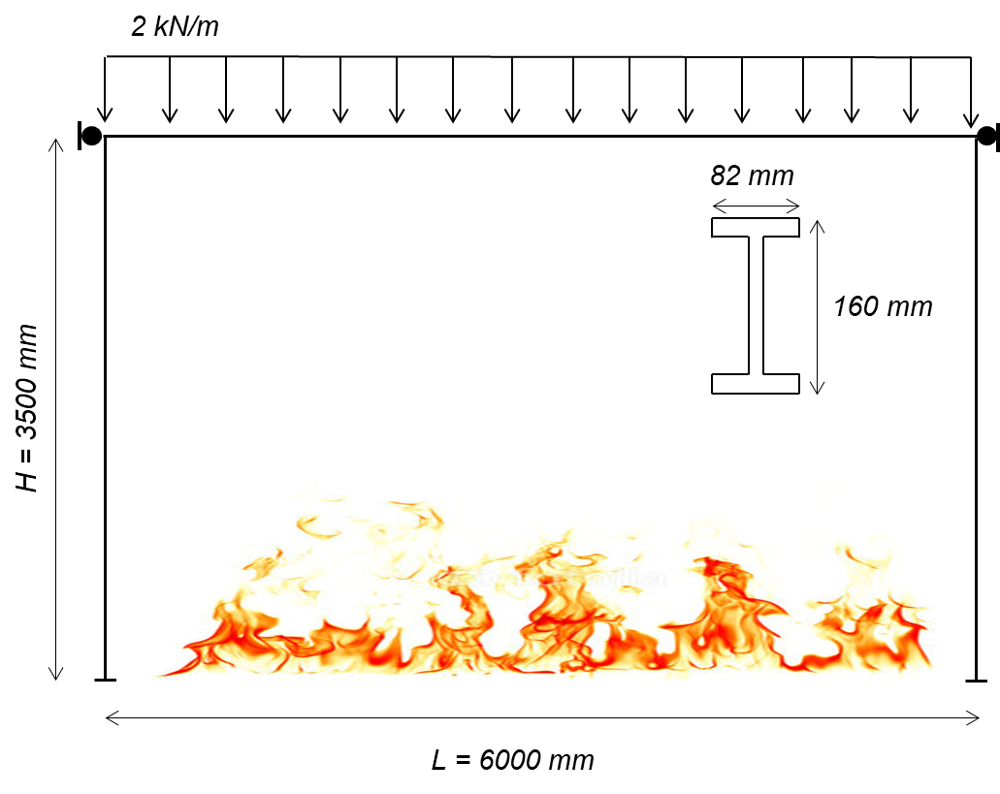
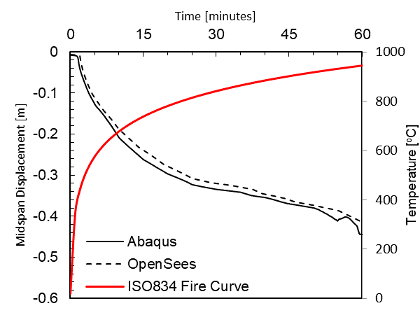

{.align-centeralign-center width="500px"}

Example overview: A one-bay frame is considered with a uniformly
distributed load (2 kN/m). The frame is exposed to a fire. Heat transfer
analyses were performed using a commercially available finite element
program to calculate the temperature distribution through the cross
section,and the temperatures at each fiber when the members are exposed
to a non-linear gas time-temperature curve. The horizontal displacements
of the top corners of frame are restrained to represent lateral bracing,
and the midspan displacement of the beam is recorded throughout the
analysis.

Download Example 4 files:

- [`Example4.tcl`](files/Example4.tcl)
- [`WsectionThermal.tcl`](files/WsectionThermal.tcl)
- [Nodal Temperature Files](files/Ex4_NodalTemperatureFiles.zip).
- [Example 4 Outputs](files/Example4_OUTPUT.zip)


## Objectives

Example 4 Objectives: 1. Develop a portal frame in OpenSees using
displacement-based elements with tempurature-dependent material
properties, and 2. Implementing user-defined time-tempurature histories
for the elements calculated through heat transfer analysis.

## Material

The uniaxialMaterial Steel01Thermal includes temperature-dependent steel
thermal and mechanical properties according to Eurocode 3 carbon steel.
More details of Steel01 can be found at: [Steel01
Material](https://opensees.berkeley.edu/wiki/index.php/Steel01_Material)

```tcl
uniaxialMaterial Steel01Thermal $matTag $Fy $Es $b;
```

Es = 210000 MPa (Young's modulus of elasticity at ambient temperatures)

Fy = 275 MPa (Yield strength of material at ambient temperatures)

b = 0.01 (Strain-Hardening Ratio)

## Transformation

Because the beams in this example experience large deflections, 2nd
order bending effects were considered using the Corotational geometric
transformation.

```tcl
geomTransf Corotational $transftag;
```

Learn more about geometric transofrmations: [Geometric
Transformation](http://opensees.berkeley.edu/wiki/index.php/Geometric_Transformation_Command)

## section

This example uses a W-shape beam, therefore an external .tcl script is
used to define the fiber sections. This script uses fibersecThermal to
procure a fibered W-shape section with a section tag to be used while
defining elements. Eight fibers are used throughout the web and four
fibers within each flange.

In previous versions of OpenSees, a default value for torsional
stiffness was used (GJ). In versions 3.1.0 and newer fiber sections
require a value for torsional stiffness. This is a 2D example with
negligible torsion, however a value is required. The Young\'s Modulus is
used for convenience.

Wsection dimensions:

```tcl
set secTag 1;
set d  160;
set bf  82;
set tf 7.4;
set tw 5.0;
set nfdw 8;
set nftw 1;
set nfbf 1;
set nftf 4;
```

-   secTag - section tag
-   matTag - material tag
-   d = nominal depth
-   tw = web thickness
-   bf = flange width
-   tf = flange thickness
-   nfdw = number of fibers along web depth
-   nftw = number of fibers along web thickness
-   nfbf = number of fibers along flange width
-   nftf = number of fibers along flange thickness
-   Gj = torsional stiffness


```tcl
# WsectionThermal secTag matTag d bf tf tw nfdw nftw nfbf nftf Gj
WsectionThermal $secTag $matTag $d $bf $tf $tw 8 1 1 4 $Es
```

{.align-centeralign-center width="500px"}


## Element

`dispBeamColumnThermal` elements are used because temperature-dependent
thermal and mechanical steel properties can be applied to these
elements. Any portion of the structure that is being heated must use
elements that are compatible with uniaxialMaterial `Steel01Thermal`. At
the time this model was developed, `dispBeamColumnThermal` was the only
element type that could have tempurature-dependent thermal and
mechanical properties applied to them.


```tcl
# dispBeamColumnThermal $eleTag $iNode $jNode $numIntgrPts $secTag $TransfTag;
element dispBeamColumnThermal 1 1 2 3 $secTag $transftag;
```

Each column and beam element is created using ten displacement-based
elements with 3 iteration points in each element.

## Output Recorders

`$dataDir` is defined at the beginning of the model, this creates a
folder within your working directory where output files will be saved.

```tcl
set dataDir Examples/EXAMPLE4_OUTPUT;
file mkdir $dataDir;
```

Displacement of the beam midspan node (27), DOF 2 (Vertical
Displacement)

```tcl
recorder Node -file $dataDir/Midspan_BeamDisp.out -time -node 27 -dof 2 disp;
```

Reaction forces at end nodes. (1 & 12)

```tcl
recorder Node -file $dataDir/RXNS.out -time -node 1 12 -dof 2 3 reaction;
```

Learn more about the Recorder Command: [Recorder
Command](http://opensees.berkeley.edu/wiki/index.php/Recorder_Command)

## Thermal Loading

This particular model is heated using a fire time tempurature curve
shown below. The fiber temperatures, or the temperature distribution
through the cross section was calculated by performing a heat transfer
analysis.

{.align-centeralign-center width="500px"}

The results from the heat transfer analysis were used as inputs for the
fiber temperatures in OpenSees. The locations of the input tempurature
locations can be seen in the figure below.

Three tempurature input files were created for the tempurature
distribution of the beam and columns. Each tempurature file has 10
columns representing: Time, T1, T2, T3, T4, T5, T6, T7, T8 & T9. Time
ranges from 0 to 1 to correlete with OpenSees analysis time steps. The
T1 through T9 columns represent temperatures at each of the locations
shown below for nine fibers through the cross section.

The red dots above below are locations where nodal temperatures were
recorded during the heat transfer analysis and red dotted lines
represent temperature input locations. The code below shows how to
define each of the temperature input locations. The temperature through
the depth of the web was constant. :

```tcl
set Y9 [expr -$d/2];
set Y2 [expr -($d/2 - 0.99*$tf)];
set Y3 [expr -($d/2 - $tf)];
set Y4 [expr -$d/4];
set Y5 0.0;
set Y6 [expr $d/4];
set Y7 [expr ($d/2 - $tf)];
set Y8 [expr ($d/2 - 0.99*$tf)];
set Y9 [expr $d/2];
```

{.align-centeralign-center width="500px"}


The bottom extreme fiber temperature must be defined first in the
thermal load pattern. The input temperature files must be in your
working directories or have their paths specified.

**Temperature loading for the beam**

```tcl
pattern Plain 11 Linear { for {set level 21} {$level \<= 30} {incr
level 1} {set eleID $level; eleLoad -ele $eleID -type -beamThermal
-source BeamTemp.txt $Y9 $Y8 $Y7 $Y6 $Y5 $Y4 $Y3 $Y2 $Y1;}}
```

**Temperature loading for column 1**

```tcl
pattern Plain 11 Linear { for {set level 1} {$level \<= 10} {incr level
1} {set eleID $level; eleLoad -ele $eleID -type -beamThermal -source
Column1Temp.txt $Y9 $Y8 $Y7 $Y6 $Y5 $Y4 $Y3 $Y2 $Y1;}}
```

**Temperature loading for column 2**

```tcl
pattern Plain 11 Linear { for {set level 11} {$level \<= 20} {incr
level 1} {set eleID $level; eleLoad -ele $eleID -type -beamThermal
-source Column2Temp.txt $Y$Y8 $Y7 $Y6 $Y5 $Y4 $Y3 $Y2 $Y1;}}
```

## Thermal Analysis

Thermal loading is applied in 1000 steps, with a load factor of 0.001.
Each step is a 0.001 increment of the maximum temperature specified in
the thermal loading step: `T`. The analysis is a static analysis and the
contraints of the beam are plain. 1000 increments was also used during
thermal analysis to allow for easy correlation between the input
temperatures and the recorded output.

A variety of load factors were examined and the solution converged when
a load factor of 0.001 was used. OpenSees is sensitive to the load
factor, therefore, it is important to ensure that benchmarking examples
are performed to determine the proper load factor to use in structural
fire engineering analyses.

```tcl
set Nstep 1000;

set Factor [expr 1.0/$Nstep];

integrator LoadControl $Factor;

analyze $Nstep;
```

## Output Plots

After the model has completed running, the results will be the vertical
midspan displacement of the beam. This displacement can be plotted
against the time of the fire. It is suggested that if the user would
like to develop a temperature history that matches every increment of
the model, the same number of tempurature inputs as time steps is used.

{.align-centeralign-center width="500px"}

## Sources

\[1\] European Committee for Standardization (CEN). (2005). Eurocode 3:
Design of Steel Structures, Part 1.2: General Rules - Structural Fire
Design.

\[2\] W. Maddalozzo and E.C. Fischer, \"Post-earthquake fire performance
of steel buildings,\" World Conference on Earthquake Engineering,
17WCEE, Sendai, Japan - September 13-18, 2020.

